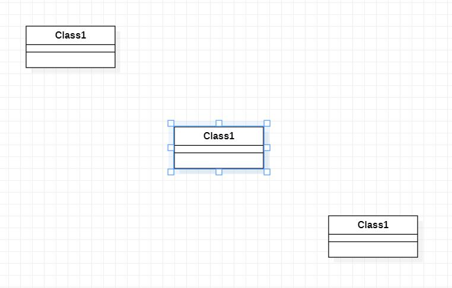

# 实验一
UML建模工具
## 实验目标
网络上课期间按视频讲解步骤操作，包括：安装软件、加入GitHub库、创建实验报告。
## 实验内容
下载并安装建模工具 StarUML，下载地址：http://staruml.io
确定个人建模选题，将选题填写在 Issues 中：
https://github.com/hzuapps/uml-modeling-2020/issues
## 实验结果

