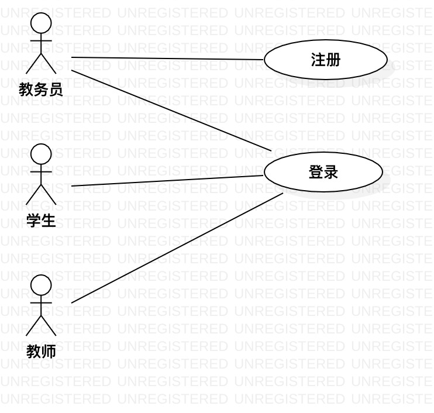

# 实验二：用例建模

## 1. 实验目标

- 
- 
- 

## 2. 实验内容

- 
- 
- 

## 3. 实验步骤

- 写跟本实验（用例）相关的步骤
- 不要写：打开StarUML
- 不要写：提交GitHub之类的步骤
- 不要写：在Markdown里面写实验报告

## 4. 实验结果

图1：XX系统的用例图

## 表1：登录用例规约  

用例编号  | UC01 | 备注  
-|:-|-  
用例名称  | 登录  |   
前置条件  |      | *可选*   
后置条件  | 学生进入教务系统首页     | *可选*   
基本流程  | 1. 学生点击登录链接；  |*用例执行成功的步骤*    
~| 2. 系统显示登录页面；  |   
~| 3. 学生输入用户名和密码，点击登录按钮；  |   
~| 4. 系统**查询到**用户信息，检查用户名与密码**相匹配**，记录用户登录状态；  |   
~| 5. 系统显示首页。  |  
扩展流程  | 4.1 系统检查发现用户不存在，**提示“用户不存在”**；  |*用例执行失败*    
~| 4.2 系统检查发现用户名与密码不匹配，**提示“密码不正确”**。  |  

