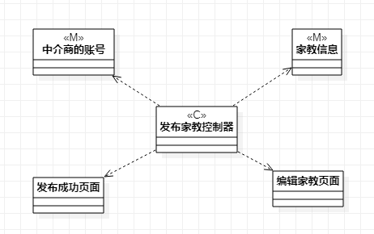
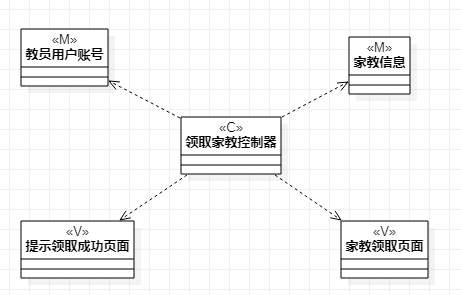

# 实验四   类建模
# 实验五   高级类建模
## 一、实验目标

1. 掌握类建模方法；
2. 掌握UML中类图（Class Diagram）的画法；
3. 熟悉了解MVC设计模式。

## 二、实验内容
1. 学习类图的基本概念和类与类的关系；
2. 在bilibili观看视频学习类建模方法和MVC设计模式；  
2. 根据用例规约使用StarUML画类图。

## 三、实验步骤  
1. 在bilibili观看实验四五类建模视频；
2. 在StarUML创建两个类图（Class Diagram）：  
（1）发布家教类图；  
（2）领取家教类图；
3. 根据用例规约画图：  
（1）使用Class图形分别画出Model、Controller和View；  
（2）使用Dependency表示Controller与Model和View的关系；
（3）使用Aggregation表示Model与View的关系。
4. 分别导出各类图的JPEG格式图片；
5. 编写lab4.md实验报告文档。

## 四、实验结果

  
图1 发布家教类图

  
图2 发布家教类图

## 五、实验收获

1. 了解了类图和类建模的方法：
    （1）描述类的类图可分为类名层、属性层和方法层等多层（实验中只画出类名层）；
    （2）类与类之间的联系：Dependency、Association、Aggregation、Composition等等。
2. 了解了MVC设计模式的基本概念：
     M：Model——模型是应用程序中用于处理应用程序数据逻辑的部分；
     V：View——视图是应用程序中处理数据显示的部分；
     C：Controller——控制器是应用程序中处理用户交互的部分。