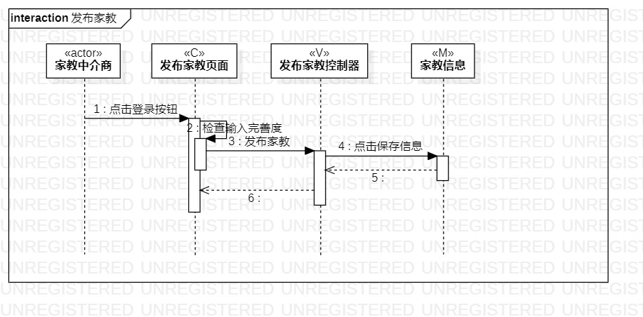
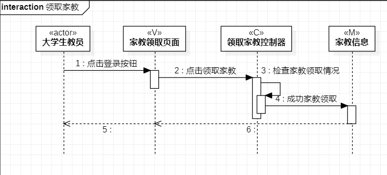

# 实验六:交互建模

## 一、实验目标

1. 理解系统交互；
2. 掌握UML顺序图的画法；
3. 掌握对象交互的定义与建模方法。

## 二、实验内容

1. 根据用例模型和类模型，确定功能所涉及的系统对象；
2. 在顺序图上画出参与者（对象）；
3. 在顺序图上画出消息（交互）。

## 三、实验步骤

1. 从用例图中找到参与者（1）
2. 从类图找到所有的参与者（N）
3. 在StarUML中创建顺序图
  - 添加关注人顺序图
  - 发布动态顺序图
4. 通过用例规约画顺序图
5. 根据最终情况修改用例规约和所有的实验所画的图

## 四、实验结果

图1 添加关注人顺序图  

图2 发布动顺序图  

## 五、实验总结

要认真看视频 做起来比较清楚