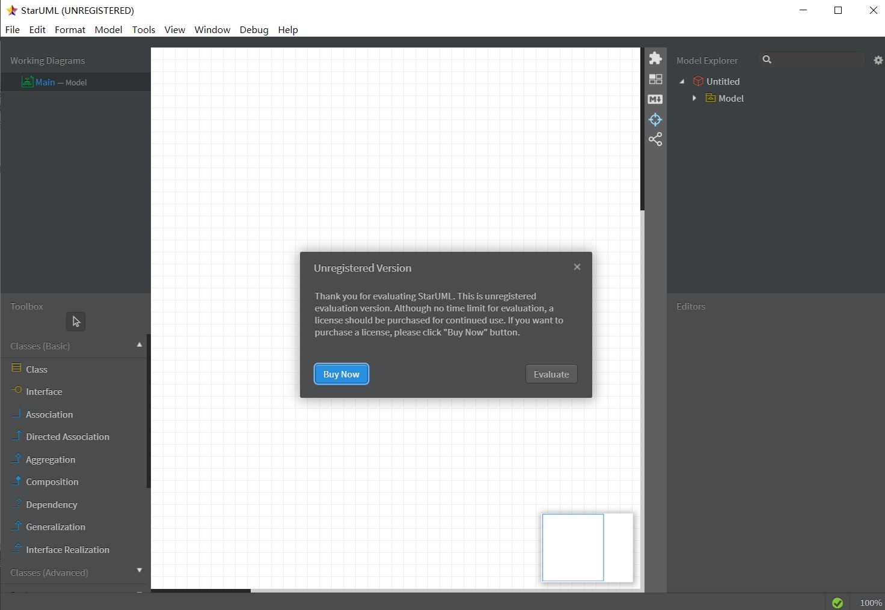

#实验一

##1. 实验目标
- 初步了解uml软件的使用
- 复习git操作

##2. 实验内容
- 安装starUml和git
- 加入GitHub库
- 创建第一个uml图
- 完成实验报告
- 提交到GitHub库

##3. 选题标题：研友系统
### 3.1 功能需求
- 考研的研友可以将自己手上的学习资料上传到系统中共享；
- 研友可以每天按时在系统中签到，互相监督学习；
- 研友可以在系统中完成指定题目，并由其他研友评价批改
- 考研前会对研友的活跃度进行评价，算出考研的努力程度

##4. 实验结果

