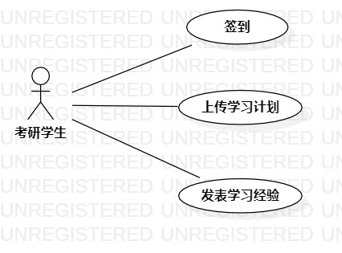

# 实验二

## 1.实验目标

- 根据选题分析系统功能需求
- 根据分析作用例图和编写用例规约

## 2.实验内容

- 细化功能需求 
- 画出用例图（Use Case Diagram）
- 编写用例规约

## 3.实验步骤

### 3.1 观看教学视频和实验要求
- 教学视频地址：https://www.bilibili.com/video/BV16E41147dv
- 实验要求地址：https://github.com/hzuapps/uml-modeling-2020/issues/3

### 3.2 学习内容
- 用例图：是指由参与者（actor）、用例（use case），边界以及它们三者之间的关系构成的。用于描述系统功能的视图。
- 用例规约：使用简洁的语言描述用例的活动基本流程。

### 3.3 画用例图
- 研友监督系统由签到功能、上传学习计划功能组成，所以有2个用例。
- 将设计的2个用例（use case）和参与者（actor）连在一起。

### 3.4 编写用例规约
- 根据设计的用例，将用例执行成功的每一个动作细化为以一个基本流程并用简洁的语言描述。
- 将用例执行失败的分支动作用简洁的语言写入扩展流程

## 4.实验结果

### 表1：签到用例规约  

用例编号  | UC01 | 备注  
-|:-|-  
用例名称  | 签到  |   
前置条件  |  进入研友监督系统  | *可选*   
后置条件  |      | *可选*   
基本流程  | 1. 研友点击签到按钮  |*用例执行成功的步骤*    
~| 2. 系统查询签到状态，确定研友今日无签到操作，记录签到时间  |  
~| 3. 系统提示“签到成功”  |  
扩展流程  | 2.1 系统检查到研友今日有签到操作，提示“不能重复签到”   |*用例执行失败*  

### 表2：上传学习计划用例规约  

用例编号  | UC02 | 备注  
-|:-|-  
用例名称  | 上传学习计划  |   
前置条件  |  进入研友监督系统    | *可选*   
后置条件  |      | *可选*   
基本流程  | 1. 研友点击上传计划按钮  |*用例执行成功的步骤*    
~| 2. 系统显示上传学习计划页面  |   
~| 3. 研友编辑学习计划,点击提交按钮  |   
~| 4. 系统检查学习计划不为空，保存计划 |  
~| 5. 系统提示“保存成功”   |  
扩展流程  | 4.1 系统检查发现学习计划为空，提示“学习计划不能为空”   |*用例执行失败*    

##5.实验心得
- 这次实验被close了很多次，主要原因是因为编写用例规约不够规范，一是对基本流程和扩展流程的描述不够简洁，二是对每个用例的活动流程没有深入考虑，忽略了细节，导致用例规约的描述模糊。本次实验通过多次的修改，也明白了用例规约中”简洁描述“的重要性，采用主谓宾的形式描述，同时谓语要准确，不能模棱两可。