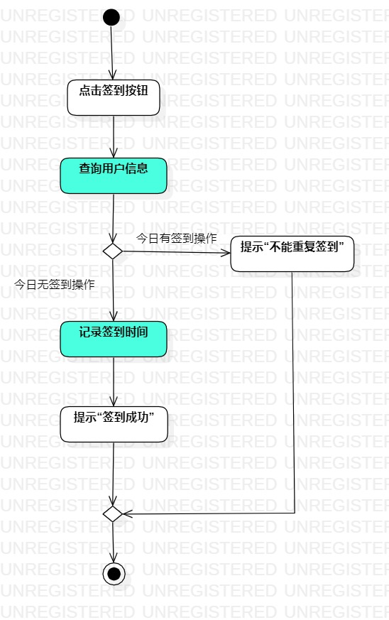
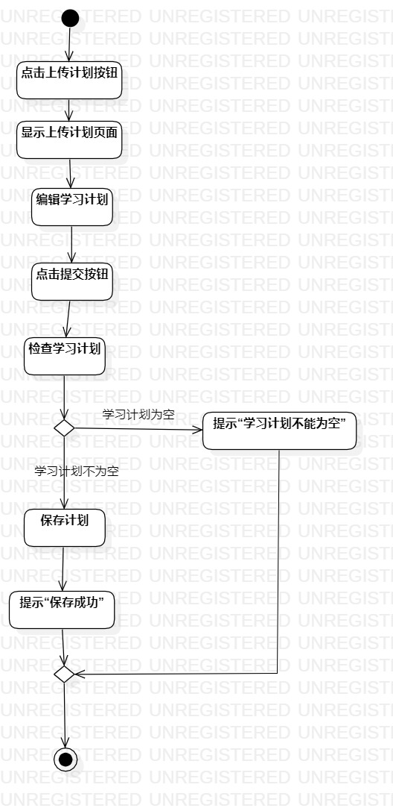

# 实验三

## 1.实验目标

- 掌握过程建模方法
- 掌握活动图的画法

## 2.实验内容

- 根据用例规约画出活动图

## 3.实验步骤

### 3.1 观看教学视频和实验要求

- 教学视频地址：https://www.bilibili.com/video/BV1cE411G7L5
- 实验要求地址：https://github.com/hzuapps/uml-modeling-2020/issues/3

### 3.2 学习内容
- 活动图：用来记录单个用例的逻辑，描述系统中一个操作中要进行的各项活动的执行流程。
- 活动图组成元素：开始节点（实心黑色圆点）、终止节点（圆圈加内部实心黑色圆点）、决策节点（菱形，每个离开的转换上都有一个条件）、活动状态（圆角矩形）、流（有方向的实线箭头）

### 3.3 确定活动状态
- 通过用例图确定每个角色（actor）发出的主要步骤会引起的活动。
- 1.签到活动分为研友点击签到按钮、系统查询用户信息、系统记录签到时间、系统提醒签到成哥、系统提醒不能重复签到；2.上传学习计划活动分为研友点击上传计划按钮、研友编辑学习计划、研友点击提交按钮、系统显示上传计划页面、系统检查学习计划、系统提示学习计划不能为空、系统保存计划、系统提示保存成功；

### 3.4 添加决策点

- 将需要判断的地方加上决策点

### 3.5 画活动图

- 添加起始节点（实心黑色圆点）和终止节点（圆圈加内部实心黑色圆点）
- 添加确定的活动状态（圆角矩形）
- 添加决策点
- 添加流（有方向的实线箭头）
## 4.实验结果

图1：签到的活动图

图2：上传学习计划的活动图

##5.实验心得
- 通过该实验掌握了画UML活动图，其中最容易忽略的是上传学习计划这个活动中当判断到需要填写的内容为空时，提醒内容不能为空后，应该返回让研友填写相关内容，而不是直接结束整个活动，这个问题是观看了老师第二个视频才发现的，证明自己对这个活动流程的把握还没有到位，没有深入思考到这个活动状态的转变。