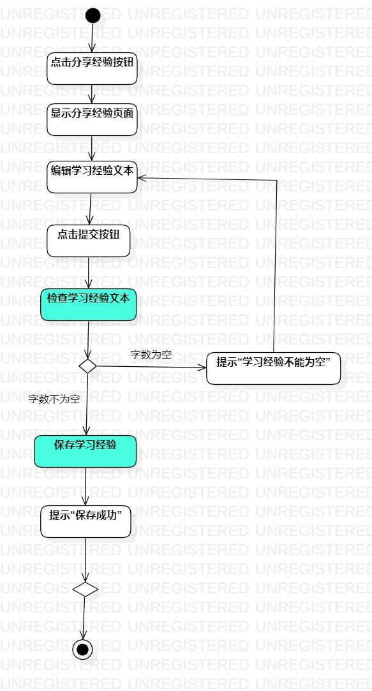

# 实验三

## 1.实验目标

- 掌握过程建模方法
- 掌握活动图的画法

## 2.实验内容

- 根据用例规约画出活动图

## 3.实验步骤

- 细读用例规约
- 对照用例规约作出相应的活动与节点（包括开始节点、结束节点和判断节点）
- 活动之间用流连接
- 写出判断节点分支处相应的满足条件

## 4.实验结果

图1：签到的活动图

图2：上传学习计划的活动图

图3：分享学习经验的活动图