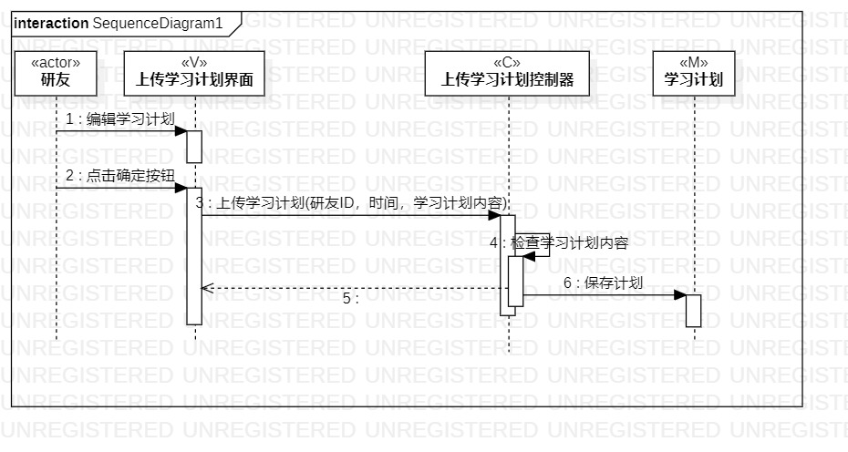

# 实验六

## 1. 实验目标

- 理解系统交互；
- 掌握UML顺序图的画法；
- 掌握对象交互的定义与建模方法。

## 2. 实验内容

- 根据用例模型和类模型，确定功能所涉及的系统对象；
- 在顺序图上画出参与者（对象）；
- 在顺序图上画出消息（交互）。

## 3. 实验步骤

###3.1 观看教学视频和实验要求
- 教学视频地址：https://space.bilibili.com/44472532/
- 实验要求地址：https://github.com/hzuapps/uml-modeling-2020/issues/6 
###3.2 学习内容
- 对象的概念：对象是真实存在的，是类的具体化
- 顺序图的构成：参与者（Participants）、时间、事件、信号与消息、存活条 
- 顺序图的时间顺序：描叙了交互发生的顺序、时间。时间顺序-从上到下
- 时间仅表示先后顺序，不表示时间跨度，垂直方向位置与时间跨度无关
- 顺序图的消息--对象交互/行为：事件=消息=信号
- 参与者的存活条/激活条：表示参与者正在忙着，显示了发送端和接收端，箭头要画在存活条上
- 各种消息类型对应的箭头：同步消息（实三角实线箭头）、异步消息（实线箭头）、返回消息（虚线箭头，可以不画）
###3.3 画顺序图
- 签到顺序图
> 从用例图找到第一个参与者（actor）：研友；从类图找到4个参与者：签到控制器、签到界面、研友信息和签到信息，总共4+1个参与者；从活动图找到操作步骤：点击签到按钮、查询签到状态、更新签到状态、记录签到时间，并画出参与者之间的消息，VC之间的消息名称是用例名称，签到，且有两个参数：研友ID和时间。

- 上传学习计划顺序图
> 从用例图找到第一个参与者（actor）：研友；从类图找到3个参与者：上传学习计划控制器、上传学习计划界面和学习计划，总共3+1个参与者；从活动图找到操作步骤：编辑学习计划、点击确定按钮、检查学习计划内容和保存计划，并画出参与者之间的消息，VC之间的消息名称是用例名称，上传学习计划，且有三个参数：研友ID、时间和学习计划内容。

## 4. 实验结果

图1：签到的顺序图

图2：上传学习计划的顺序图

## 5. 实验心得

- 本次实验把前面的几个实验都串在一起了，画顺序图的时候不断地发现前面活动图或者用例图的语言表述或者设计不太规范，要不断地进行修改，进行这个实验之前我把之前的一个用例删除了，主要是因为被删除的那个用例和第二个用例的操作太相近了，不管是类图还是活动图，都是把名字修改一下，于是觉得没有什么必要，就删除了，通过这次实验基本把自己这个系统的问题捋清楚了。