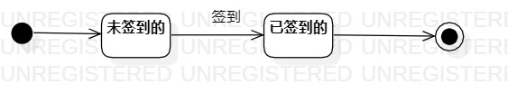
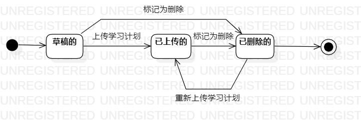

# 实验六

## 1. 实验目标

- 掌握对象建模
- 掌握状态图的画法

## 2. 实验内容

- 根据用例图、用例规约、活动图、类图和顺序图作状态图

## 3. 实验步骤

###3.1 观看教学视频和实验要求
- 教学视频地址：https://space.bilibili.com/44472532/
- 实验要求地址：https://github.com/hzuapps/uml-modeling-2020/issues/7
###3.2 学习内容
- 对象的状态：1.找关键对象进行建模(不拘泥于选择的功能);2.状态的状态取决于对象所包含的所有数据。
- 状态：其要存在于系统中，是某个确切时间所处的条件；状态可以是被动的，也可以是主动的
- 状态图的构成：a.一张图是一个对象;b.状态(圆角矩形);c.转变(实线箭头，箭头上表明事件)。
- 转变：从源状态到目标状态所经过的处理。
- 状态图画法：a.寻找一个重要对象;b.寻找这个对象的所有重要状态，状态命名使用形容词，并且要注意合并相同状态的状态;c.画出状态之间的转变条件。
###3.3 画状态图
- 研友状态图
> 确定研友为对象，通过签到活动图确定两个重要状态：未签到的、已签到的，未签到的可以转变成已签到的，但已经签到的状态无法变更为未签到状态

- 学习计划状态图
> 确定学习计划为对象，通过上传学习计划活动图确定三个重要状态：草稿的、已上传的和已删除的，草稿的可以通过上传学习计划来转变成已上传的，且可以通过标记为删除转变成已删除的，已上传的可以通过标记为删除的转变成已删除的，已删除的可以通过重新上传学习计划来转变成已上传的。

## 4. 实验结果

图1：研友状态图

图2：学习计划状态图

## 5. 实验心得

- 本次实验主要是画状态图，画的过程是比较纠结的，因为不知道该不该将一些原本没有的功能加上去，有些加上去感觉会产生歧义，有些加上去效果会更好，所以还是加了一些，最后还是听取老师的一些建议来修改。