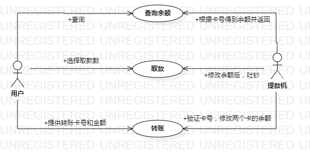

# 实验二

## 实验目的

1. 确认建模选题并提交审核通过
2. 完善实验一文档
3. 根据选题建立用例视图和用例表，编写实验二文档

## 实验内容

1. 确认选题为自动提款机系统，并提出三个功能需求为识别卡号并登陆、查询余额、取款并修改余额数
2. 根据选题和功能需求创建用例视图和用例表
3. 编写实验一和实验二文档

## 实验步骤

​        根据老师上传的视频学会了操作Markdown文档的方法以及建立用例图、用例表的格式要求。最难的是选题的确定，上个星期没想到感兴趣或者自己有过探索分析的选题，就耽搁了下来，这周在github上浏览了很多同学提交的选题后，受到启发选定了自主提款机系统并罗列出三功能，其实还想到有其他的，如打印凭条等都可以应用，只要选题定下来了，其它的都好做，用例表和用例视图根据功能来做就好，没遇到什么困难，唯一的难点就是选题。

## 实验结果

选题用例视图

## 用例表

### 表1：查询余额

| 用例编号 | 01                                                           | 备注                 |
| -------- | :----------------------------------------------------------- | -------------------- |
| 用例名称 | 查询余额                                                     |                      |
| 前置条件 | 用户进入服务界面                                             | 可选                 |
| 后置条件 |                                                              | *可选*               |
| 基本流程 | 1.用户点击查询余额按钮                                       | *用例执行成功的步骤* |
| ~        | 2.系统根据卡号查询银行卡后台数据库获取余额数并把数据显示在界面上 |                      |
| 扩展流程 | 2.11 系统无法查询银行卡信息                                  |                      |
| ~        | 2.12 系统网络通讯故障或升级中                                |                      |

### 表2：取款

| 用例编号 | 02                                                           | 备注                 |
| -------- | :----------------------------------------------------------- | -------------------- |
| 用例名称 | 取款                                                         |                      |
| 前置条件 | 用户银行卡余额超过100元                                      | *必要*               |
| 后置条件 |                                                              | *可选*               |
| 基本流程 | 1.用户点击取款按钮                                           | *用例执行成功的步骤* |
| ~        | 2.系统跳出取款金额选择界面                                   |                      |
| ~        | 3. 用户选择取款金额后点击对应的确认按钮                      |                      |
|          | 4. 系统修改账户余额，提款机取钞口吐出人名币                  |                      |
|          | 5. 用户取走钱，点击退卡按钮,取走卡                           |                      |
| 扩展流程 | 3.1 用户选取确认的金额数大于账户余额数                       |                      |
| ~        | 3.11 系统弹出带有您的余额不足，请重新选择取款金额信息的界面  |                      |
|          | 3.12 用户点击确认按钮后进入选取金额界面重新选择              |                      |
|          | 3.2 用户选取确认的金额数大于提款机上所剩的纸质钞票金额数     |                      |
|          | 3.21 系统跳出带有机器余额不足，取款操作失败，请前往银行柜台或其它提款机上进行取款信息的界面 |                      |
|          | 3.22 用户点击退卡，取走卡                                    |                      |

### 表3：转账

| 用例编号 | 03                                                           | 备注                 |
| -------- | :----------------------------------------------------------- | -------------------- |
| 用例名称 | 转账                                                         |                      |
| 前置条件 | 知道需要转账的卡号                                           | *必要*               |
| 后置条件 |                                                              | *可选*               |
| 基本流程 | 1.用户点击转账按钮                                           | *用例执行成功的步骤* |
| ~        | 2.系统弹出转账卡号输入界面                                   |                      |
| ~        | 3. 用户输入转账卡号后点击确认按钮                            |                      |
| ~        | 4. 用户再次确认转账卡号                                      |                      |
| ~        | 5. 系统弹出转账金额输入界面                                  |                      |
| ~        | 6. 用户输入转账金额，点击确认按钮                            |                      |
| ~        | 7.系统根据卡号分别修改两张卡的余额后返回转账成功信息         |                      |
| 扩展流程 | 4.1 用户点击取消                                             |                      |
| ~        | 4.2 回到基础流程 3                                           |                      |
|          | 4.21 用户点击退出，放弃转账                                  |                      |
| ~        | 6.1 用户输入的转账金额数大于其账户余额数                     |                      |
| ~        | 6.2 系统弹出带有您的余额不足，请重新输入转账金额或者返回信息的转账金额数输入界面 |                      |
| ~        | 6.3 用户点击返回按钮退出                                     |                      |
| ~        | 6.31 用户重新输入合适的转账金额后点击确认按钮，之后回到基础流程 |                      |