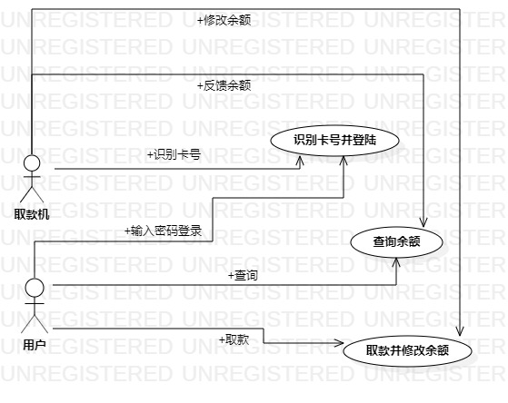

# 实验二

## 实验目的

1. 确认建模选题并提交审核通过
2. 完善实验一文档
3. 根据选题建立用例视图和用例表，编写实验二文档

## 实验内容

1. 确认选题为自动提款机系统，并提出三个功能需求为识别卡号并登陆、查询余额、取款并修改余额数
2. 根据选题和功能需求创建用例视图和用例表
3. 编写实验一和实验二文档

## 实验步骤

​        根据老师上传的视频学会了操作Markdown文档的方法以及建立用例图、用例表的格式要求。最难的是选题的确定，上个星期没想到感兴趣或者自己有过探索分析的选题，就耽搁了下来，这周在github上浏览了很多同学提交的选题后，受到启发选定了自主提款机系统并罗列出三个功能，其实还想到有其他的，如转账、打印凭条等都可以应用，只要选题定下来了，其它的都好做，用例表和用例视图根据功能来做就好，没遇到什么困难，唯一的难点就是选题。

## 实验结果

    

选题用例视图

