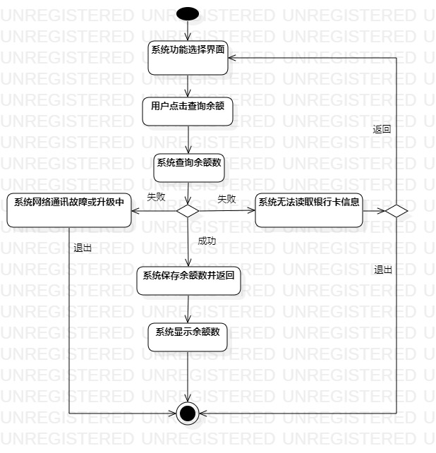
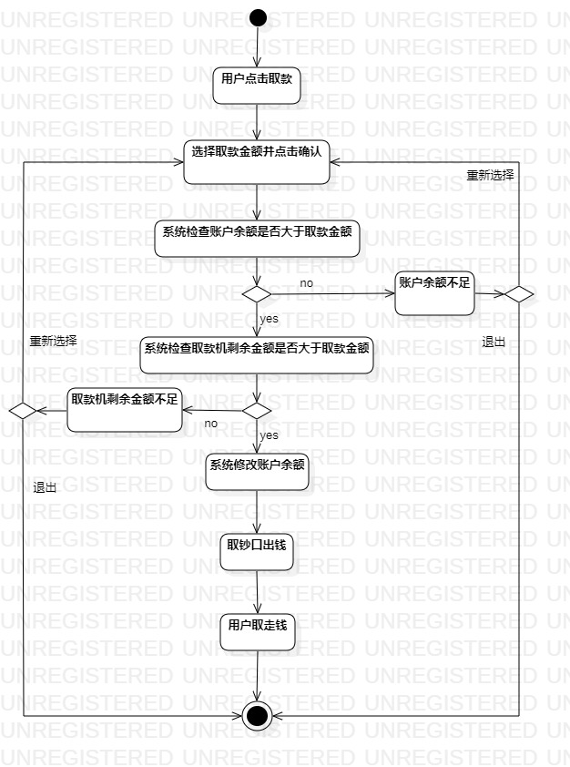
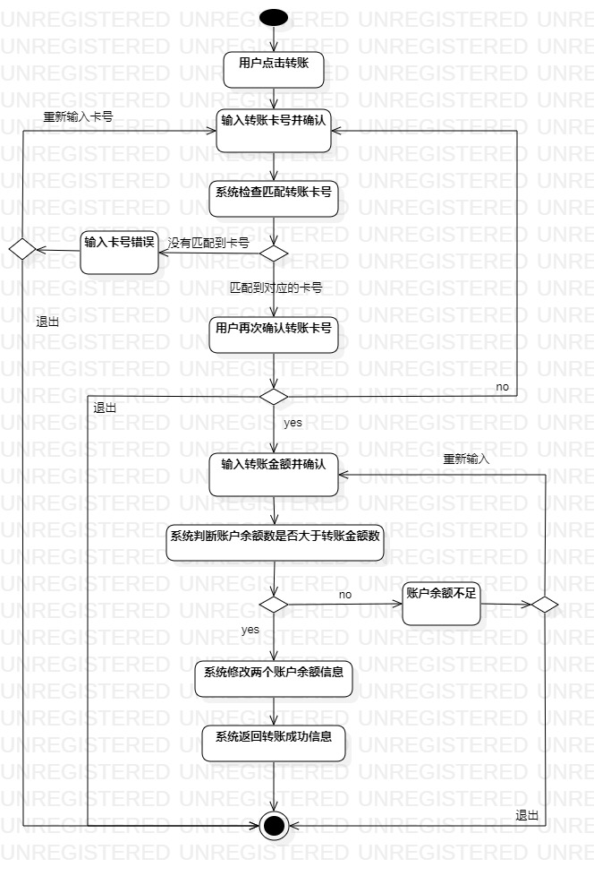

# 实验三

## 实验目的

1. 根据实验二建立的用例表完成过程建模的活动图画绘制

## 实验内容

1. 绘制查询余额用例活动图
2. 绘制取钱用例活动图
3. 绘制转账用例活动图
4. 完成实验三的文档撰写

## 实验步骤

​        这周的实验主要是画出活动图，画图的过程可以让自己更清晰功能的实现过程，可以完善实验二的用例表细节，互相对照，让功能的实现更加清晰明确。这次我更新了一下实验二的文档，完善了转账功能的用例，在画活动图时遇到点问题，主要是一些格式的问题和关于判断节点的使用细节不会，在看完老师的视频后重新修改了活动图。

## 实验结果

