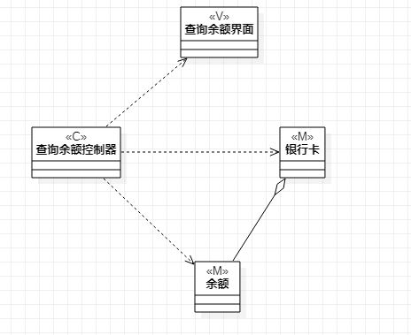
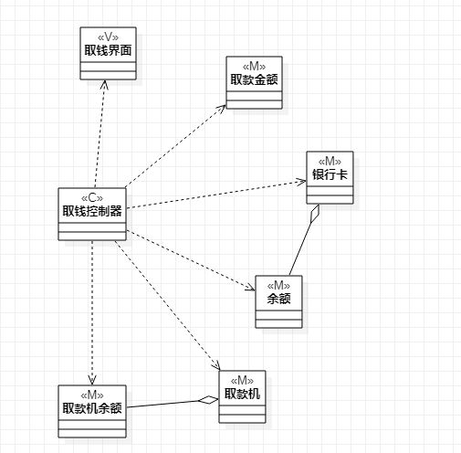
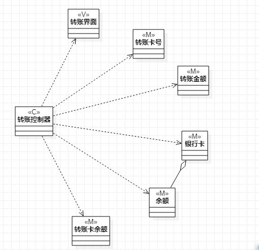

# 实验四-实验五

实验目的

1. 掌握类建模的方法
2. 了解MAC或你熟悉的设计模式
3. 掌握类图的画法。（Class Diagram）

## 实验内容

1. 基于MAC模式设计类
2. 设计类的关系
3. 画出类图

## 实验步骤

        这周的实验我根据老师批改实验三后给出问题和建议，修改了实验二的文档，给查询余额功能用例添加了扩展流程，具体的修改在实验文档会看到，之后又相应修改了实验三中查询余额的活动图，对实验三转账活动图也做了修改，实验三的文档也及时更新，实验四和实验五主要是画出类图，描述类的关系，一开始有些不理解哪些才算是类，类图的其他项怎么去定义、起名，看了老师的视频后有所了解，画出类图后想要提交实验时网页出现问题，谷歌浏览器在打开github网页时提示连接不是私密连接，进不去，百度之后试了三种方法都没有解决，之后自己尝试在Internet选项的内容证书不受信任的发布者信息那里，删除了一个Google的信息后解决问题。

## 实验结果

