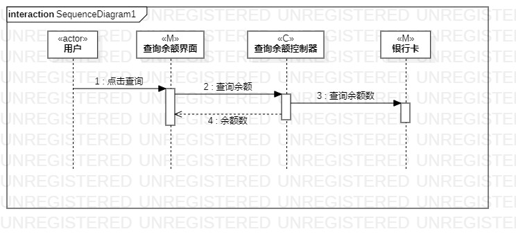
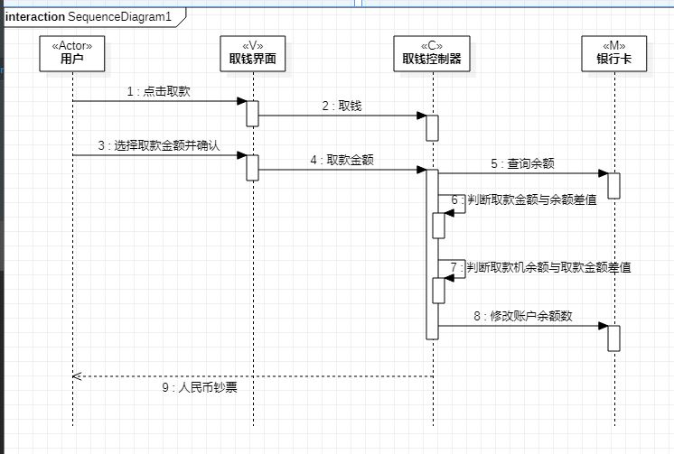
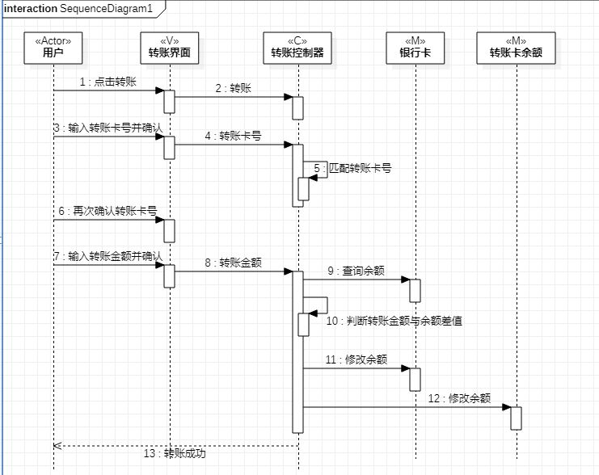

# 实验六

## 实验目的

1. 理解系统交互；
2. 掌握UML顺序图的画法；
3. 掌握对象交互的定义与建模方法。

## 实验内容

1. 根据用例模型和类模型，确定功能所涉及的系统对象；
2. 在顺序图上画出参与者（对象）；
3. 在顺序图上画出消息（交互）。

## 实验步骤

        实验过程遇到很多问题，看了好多遍老师的视频，也看了一些其他同学通过了的实验文档，第一步是根据之前的实验找到所有的参与者，然后根据流程来确定消息的顺序。第一次提交很多问题，自己又去看了一遍老师的视频，参考了一些同学们的图，之后对实验五的类图做了一遍修改，重新把实验六的顺序图梳理了一遍。

## 实验结果

