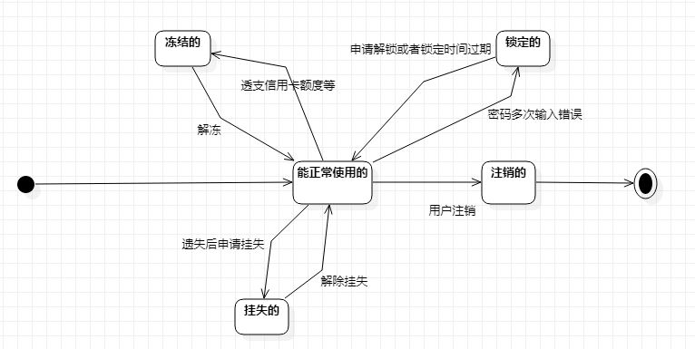

# 实验七

## 实验目的

1.  掌握对象状态建模（状态图，Statechart）。 

## 实验内容

1. 寻找一个关键的对象；
2. 设计该对象的关键状态；

- 对象的状态是：对象所表示的数据。如果数据发生变化，状态就是发生变化。
- 描述状态：形容词。
- 订单： 新的（New）、已付款的、取消的、已发货的、已签收的、退货中的、 完成的。

3. 设计状态之间的转变条件。

## 实验步骤

        这次实验修改了实验四五的内容，重新做了实验六的顺序图，也回去看了实验一二三的文档，对于这周的状态建模实验，我选择了三个用例中都会涉及到的对象--余额，根据自己选择的功能确定了它的状态：保持不变、增加、减少。第一次提交后老师说余额不是对象，应该是我的理解有偏差吧，我觉得它能够被操作，有实际的意义，虽然虚拟，但跟老师的那个账号例子是一样的。这次我选的对象为银行卡，状态有冻结、锁定、注销、挂失。

## 实验结果

银行卡状态转移图：

