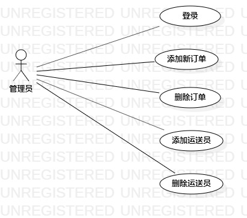

## 实验二：用例建模

## 实验目标
- 1.使用Markdown编写报告
- 2.细化选题
- 3.学习使用StarUML用例建模

## 实验内容
- 1.细化功能需求。
- 2.画出用例图（Use Case Diagram）。
- 3.编写用例规约（表格）。
## 实验步骤
- 1.选题为物流订单系统。
- 2.根据选题画出用例图。
- 3.确定参与者（actor）:
  - 管理员
- 4.确定用例（UserCase）:
  - 添加新订单
  - 删除订单
  - 添加运送员
- 5.建立Actor和UserCase之间的联系。
- 6.绘画用例图（Lab2_UseCaseDiagram）。
- 7.编写用例规约。
## 实验结果
- 1.画图

图1.物流订单系统的用例图

## 表1：添加新订单用例规约 

用例编号  | UC01 | 备注  
-|:-|-  
用例名称  | 添加新订单  |   
前置条件  |管理员已登录进入系统|    
后置条件  | 系统存储订单信息 |   
基本流程  | 1. 管理员在系统首页点击添加订单按钮 |   
~| 2. 系统显示订单添加页面  |   
~| 3. 管理员输入订单货物种类、重量、尺寸信息，点击添加按钮 |   
~| 4. 系统检查订单信息是否符合要求 |   
~| 5. 订单符合要求，系统存储订单信息，提示"订单添加成功"|   
~| 6.管理员点击是按钮确认|   
~| 7. 系统显示订单信息页面  |  
扩展流程  | 5.1 系统检查订单信息不符合要求，提示"订单信息不符合要求"  |  
~|  |  

## 表2：删除订单用例规约 

用例编号  | UC02 | 备注  
-|:-|-  
用例名称  | 删除订单  |   
前置条件  |管理员已登录进入系统|    
后置条件  | 系统删除订单信息 |   
基本流程  | 1. 管理员在系统首页点击删除订单按钮  |   
~| 2. 系统显示订单信息页面  | 
~| 2. 管理员点击删除按钮 | 
~| 3. 系统提示"是否要删除此订单？"  |   
~| 4. 管理员点击是按钮确认  |   
~| 4. 系统删除订单信息，提示"订单已删除"  |   
~| 5. 管理员点击按钮是确认  |  
~| 6. 系统显示订单信息页面  | 
扩展流程  | 4.1 管理员点击否按钮，提示关闭 |  
~|  |  

## 表3：添加运送员用例规约 

用例编号  | UC03 | 备注  
-|:-|-  
用例名称  | 添加运送员  |   
前置条件  |管理员已登录进入系统|    
后置条件  | 系统存储运送员信息 |   
基本流程  | 1. 管理员在系统首页点击添加运送员按钮；  |   
~| 2. 系统显示运送员添加页面；  |   
~| 3. 管理员输入运送员姓名、电话，点击添加按钮；  |   
~| 4. 系统检查运送员信息是否符合要求；  |   
~| 5. 运送员信息符合要求，系统存储运送员信息，提示"运送员信息添加成功"  |   
~| 6. 管理员点击按钮是确认 |  
~| 7. 系统显示运送员信息页面。  |  
扩展流程  | 5.1 系统检查运送员信息不符合要求，提示"运送员信息不符合要求"  |  
~|  |  

