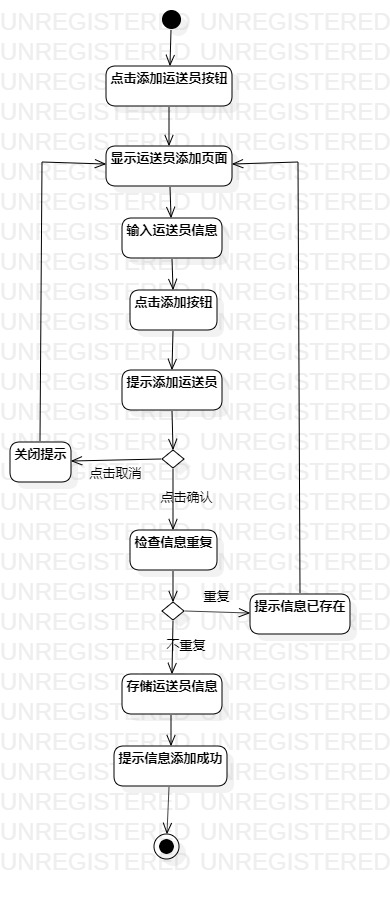
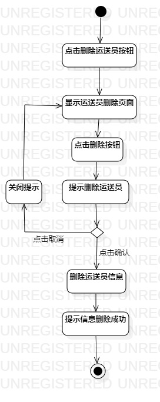

## 实验三：过程建模
## 一、实验目标
#### 1. 掌握过程建模的方法；
#### 2. 掌握活动图的画法。
## 二、实验内容
#### 1. 学习过程建模；
#### 2. 画出活动图。
## 三、实验步骤
#### 1. 观看教学视频，学习活动图绘制方法。
#### 2. 根据用例规约制作活动图。
## 四、实验结果
#### 活动图1：添加运送员
  
#### 活动图2：删除运送员
  

## 五、实验总结
#### 1.起始点用实心圆表示，终点用带圆圈的实心圆表示
#### 2.用例规例的基本流程和扩展流程画为操作，用圆角矩形表示
#### 3.操作之间用箭头相连
#### 4.在遇到扩展流程时，用菱形表示决策
#### 5.粗直线表示流程并行
