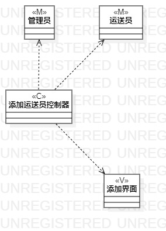
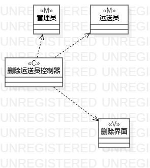

# 实验四：类建模
# 实验五：高级类建模

## 一、实验目标
1. 掌握类的概念和类之间的关系；
2. 了解MVC设计模式；
3. 掌握类的建模方法；
4. 掌握类图画法。

## 二、实验内容
1. 在用例规约中寻找类；
2. 根据MVC设计模式画类图。

## 三、实验步骤
1. 从用例规约中寻找类；
2. 将找到的类分为三类，模型类、视图类和控制器类；
3. 确定类与类之间的联系；
4. 画类图。

## 四、实验结果

图1：添加运送员类图

图2：删除运送员类图

## 五、实验笔记
1. 类的组成：
- 名称(ClassName)
- 属性(Attribute)
- 操作(Operation)
2. 类的可见性：
- public
- protected
- package
- private
3. 类之间的关系：
- 依赖(dependency)
- 联系(association)
- 聚合(aggregation)
- 组合(composition)
- 继承(inheritance)

