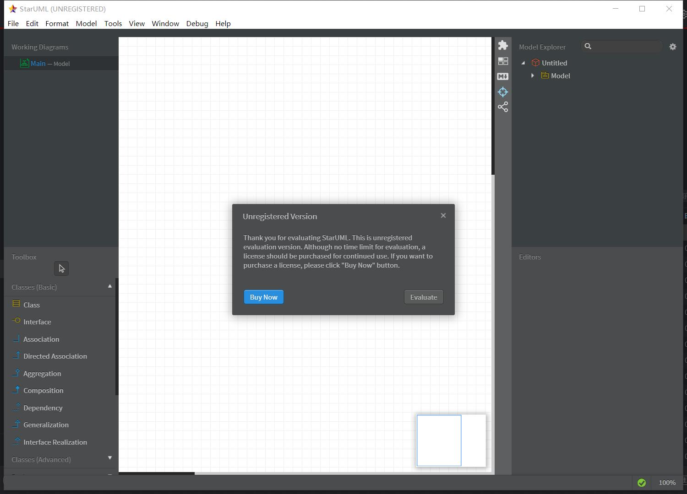
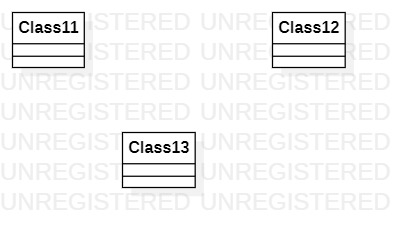

# 实验一

### 实验目标
>- 初步了解uml软件的使用
>- 复习git的操作

### 实验内容
>- 安装starUml和git
>- 加入github库
>- 创建第一个uml图
>- 完成实验报告
>- 提交到github库

### 选题标题 : 学校网络教学系统
>- 功能需求
>> 1. 教师可通过创建课堂，在该课堂上传学习资料等供学生参阅
>> 2. 可在该课堂群内发布当堂小习题供学生作答，并记录每个学生的答题情况
>> 3. 教师可通过限时签到的方式在群里让学生签到，并记录每个人的考勤情况
>> 4. 教师可发布作业任务，学生提交作业后老师可评价分数
>> 5. 课程结束后可通过作业、课堂习题、考勤情况自动计算出每个学生的平时成绩

### 实验结果

