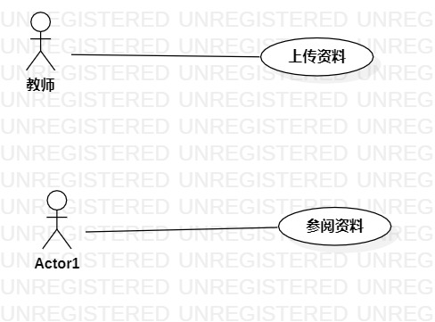

# 实验二 : 用例建模

### 实验目标
> 选题
> 根据选题建模
> 学会编写用例规约

### 实验内容
>- 描述功能
>- 创建用例图
>- 书写实验报告

### 实验步骤
> 1. 选题: #155 学校网络教学系统
> 2. 描述选题的功能:
	(1) 上传资料：教师进入课程群上传资料的界面，上传文件
    (2) 参阅资料：学生进入课程群资料的界面，查看资料
> 3. 确定参与者(Actor): 教师、学生
> 4. 确定用例(User case)
	(1) 上传资料
	(2) 参阅资料
> 5. 画用例图
> 6. 编写用例规约
### 实验结果

### 用例规约的编写

#### 表1：上传资料用例规约 

 用例编号  | UC01 | 备注  
-|:-|-  
用例名称  | 上传资料  |   
前置条件  |   教师已创建班级群       | 
后置条件  |          | *可选*   
基本流程  | 1.教师进入班级群 |  *用例执行成功的步骤*    
~| 2.点击上传资料按钮 |   
~| 3.显示选择文件的界面 |   
~| 4.教师选择资料并上传到系统   |   
~| 5.系统检查文件大小|
~| 6.系统保存文件 |  
~| 7.系统显示上传成功 |
扩展流程  | 5.1 上传的文件超过100M，系统不保存，提示文件大于100M |  *用例执行失败*    

#### 表2：查找资料用例规约

 用例编号  | UC02 | 备注  
-|:-|-  
用例名称  | 参阅资料  |   
前置条件  |   学生已加入班级群       |
后置条件  |          |*可选*   
基本流程  | 1.学生进入班级群 |  *用例执行成功的步骤*    
~| 2.点击资料按钮 |   
~| 3.界面显示已有资料 |   
~| 4.点击查找资料的搜索框  |   
~| 5.输入资料名，系统检查输入不为空，根据资料名称查找资料   |  
~| 6.系统返回资料查询结果   |  
~| 7.显示资料查询结果 |
扩展流程  | 5.1 系统检查资料名称为空，提示“关键字为空，请输入” |  *用例执行失败* 
		 
