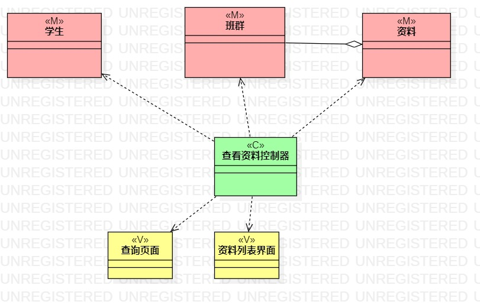

 实验四:类建模
# 实验五:高级类建模

 ## 一、实验目标
- 掌握类的概念、可见性、表示方式
- 掌握类建模方法
- 了解MVC设计模式，model、view、controller之间的关系
- 理解类的5种关系
- 掌握类之间关系的画法
## 二、实验内容
- 根据用例规约绘制相应的类图。

    1.上传资料类图

    2.查找资料类图

## 三、实验步骤
- 在StarUml中创建类图
  1.上传资料
  2.查找资料
- 从用例规约中的基本流程和扩展流程中寻找类
- 从系统的需求挖掘必要的类
- 根据mvc设计模式确定类的关系
## 四、实验结果
![上传资料类图(./lab4&5_1.jpg)
图1 上传资料类图

图2 查找资料类图、
## 五、学习笔记
类的概念：1.有标识 2.事物的类型、真实存在 3。有属性（状态）、操作（行为）
类的表示矩形 = 名称 + 属性 + 操作
类可见性：Public Protected Package Private
虚线箭头：表示该类被另外一个类使用（最弱） 三角形空心箭头：继承(最强) 建模越弱越好=>减少耦合
MVC: model:模型、实体、数据 view：视图、界面 Control:控制器、Service、通过controller三个才可以互相交互
上网搜索的资料:
 1. 泛化（Generalization）
        【泛化关系】：是一种继承关系，表示一般与特殊的关系，它指定了子类如何特化父类的所有特征和行为。例如：老虎是动物的一种，即有老虎的特性也有动物的共性。
        【箭头指向】：带三角箭头的实线，箭头指向父类
 2. 实现（Realization）
        【实现关系】：是一种类与接口的关系，表示类是接口所有特征和行为的实现.
        【箭头指向】：带三角箭头的虚线，箭头指向接口
3. 关联（Association)
        【关联关系】：是一种拥有的关系，它使一个类知道另一个类的属性和方法；如：老师与学生，丈夫与妻子关联可以是双向的，也可以是单向的。双向的关联可以有两个箭头或者没有箭头，单向的关联有一个箭头。
        【代码体现】：成员变量
        【箭头及指向】：带普通箭头的实心线，指向被拥有者
 4. 聚合（Aggregation）
        【聚合关系】：是整体与部分的关系，且部分可以离开整体而单独存在。如车和轮胎是整体和部分的关系，轮胎离开车仍然可以存在。
        聚合关系是关联关系的一种，是强的关联关系；关联和聚合在语法上无法区分，必须考察具体的逻辑关系。
        【代码体现】：成员变量
        【箭头及指向】：带空心菱形的实心线，菱形指向整体
 5. 组合(Composition)
        【组合关系】：是整体与部分的关系，但部分不能离开整体而单独存在。如公司和部门是整体和部分的关系，没有公司就不存在部门。
        合关系是关联关系的一种，是比聚合关系还要强的关系，它要求普通的聚合关系中代表整体的对象负责代表部分的对象的生命周期。
		【代码体现】：成员变量
		【箭头及指向】：带实心菱形的实线，菱形指向整体
6. 依赖(Dependency)
        【依赖关系】：是一种使用的关系，即一个类的实现需要另一个类的协助，所以要尽量不使用双向的互相依赖.
        【代码表现】：局部变量、方法的参数或者对静态方法的调用
        【箭头及指向】：带箭头的虚线，指向被使用者
		各种关系的强弱顺序：

        泛化 = 实现 > 组合 > 聚合 > 关联 > 依赖 