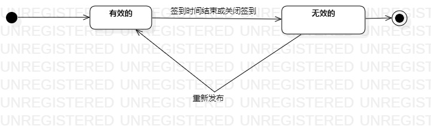

# 实验七：状态建模

## 一、实验目标
1. 掌握对象的状态建模（Statechart）。

## 二、实验内容
1. 根据用例图、活动图、类图、顺序图来画出状态图;
2. 编写实验报告文档。

## 三、实验步骤
1. 选择对象：签到
2. 寻找这个对象最重要的状态：有效的、无效的。
3. 在StarUML画出签到的状态图:
- 添加状态，并画出状态之间的转变条件。
4. 编写实验报告文档。

## 四、实验结果
  
图1：签到的状态图

## 五、课堂笔记
1.找最关键的状态 
2.状态取决于对象所包含的所有数据，数据发生变化 也就是状态发生变化，状态会影响业务的流程
3.选取对象要真实存在于现实，也要可存在于计算机中