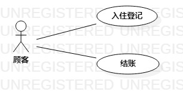

# 实验二：用例建模

## 一、实验目标

1. 学会使用Markdown写报告
2. UML建模选题
3. 掌握用例图的画法

## 二、实验内容

1. 选题
2. 绘制用例图

## 三、实验步骤

1. 根据选题确定2个功能（用例）
- 入住登记
- 退房
2. 确定系统参与者
- 顾客
3. 建立用例和参与者的联系
4. 描述用例规约

## 四、 实验结果

图1：酒店自助开房退房系统的用例图

## 表1：入住登记用例规约

用例编号  | UC01 | 备注  
-|:-|-  
用例名称  | 入住登记 |   
前置条件  |  | *可选*   
后置条件  | 系统返回主界面 | *可选*   
基本流程  | 1.顾客点击入住登记按钮； |*用例执行成功的步骤*    
~| 2.系统显示房间选择页面（只显示可入住房间）；|   
~| 3.顾客选择房间或选择退回主界面；|   
~| 4.系统显示入住登记页面。|
~| 5.顾客登记基本信息；|   
~| 6.系统检测顾客信息无误，保存顾客信息，修改房间状态；|   
~| 7.系统提示“登记成功”，显示主界面；|  
扩展流程  | 6.1系统检测发现顾客信息有误，提示『信息输入有误，请重新登记信息』，显示入住登记页面 |*用例执行失败*

## 表2：退房用例规约

用例编号  | UC02 | 备注  
-|:-|-  
用例名称  | 退房 |   
前置条件  |   | *可选*   
后置条件  | 系统返回主界面 | *可选*   
基本流程  | 1.顾客输入身份证号； |*用例执行成功的步骤* 
~| 2.系统显示费用结算页面； |
~| 3.顾客输入身份证号； |
~| 4.系统查询账单； |   
~| 5.顾客点击确认按钮； |   
~| 6.系统显示付费二维码； |   
~| 7.顾客扫描二维码支付； | 
~| 8.系统检测到顾客支付信息，保存收款信息； |  
~| 9.系统提示“支付成功”，显示主界面。 | 
扩展流程  | 8.1系统1分钟内仍未检测到顾客支付信息，提示『请确认支付』 |*用例执行失败*    

