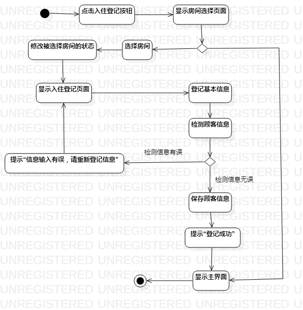
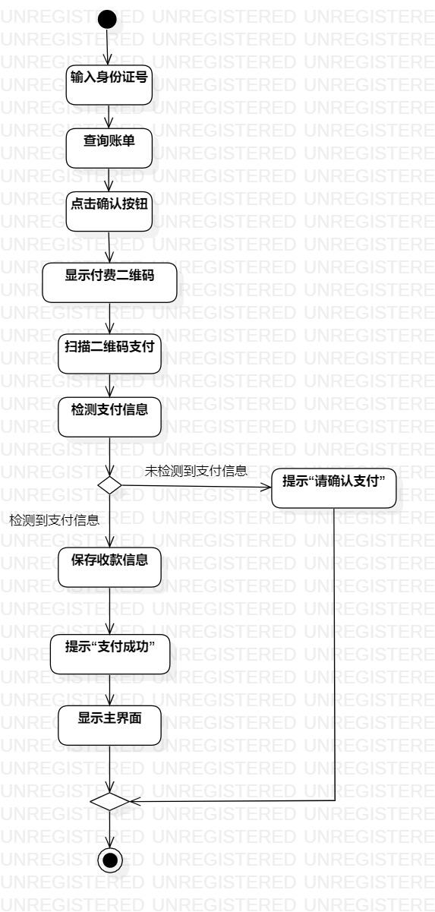

# 实验三：过程建模

## 一、实验目标

1. 掌握过程建模方法
2. 掌握活动图画法

## 二、实验内容

1. 根据实验二的用例规约完成活动图

## 三、实验步骤

1. 根据用例规约的基本流程和扩展流程确定Action
2. 根据用例规约的扩展流程确定Decision
3. 根据业务流程连接Action

## 四、 实验结果

图1：酒店自助开房退房系统的入住登记活动图

图2：酒店自助开房退房系统的退房活动图
