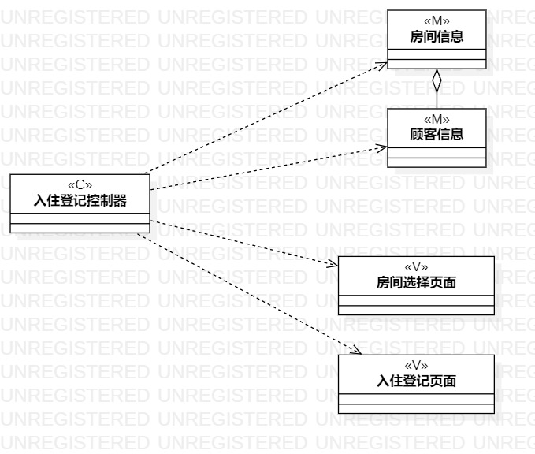
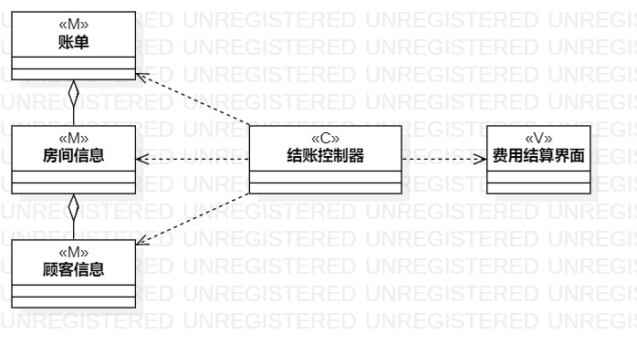

# 实验四、五：类建模

## 一、实验目标
1. 掌握类建模方法；
2. 了解MVC设计模式；
3. 掌握类图画法。

## 二、实验内容
1. 根据MVC设计模式寻找类；
2. 画类图。

## 三、实验步骤
1. 从实验2的用例规约中的基本流程和扩展流程中寻找类；
2. 通过MVC模式将找到的类分类；
3. 确定类与类之间的联系；
4. 画类图。

## 四、实验（上课）笔记
1. 类的画法：名称（ClassName）+属性（Attribute）+操作（Operation）
2. 类的可见性
	- public（+）
	- protected（#）
	- package（~）
	- private（-）
3. 类与类之间的联系（推荐低耦合的设计）
	- 依赖（dependency）
	- 联系（association）
	- 聚合（aggregation）
	- 组合（composition）
	- 继承（inheritance）
4. MVC设计模式
    - Model
        - 模型
        - 实体
        - 数据
    - View
		- 视图
		- 界面
		- AbcUI
    - Controller
		- 控制器
		- 系统
		- Controller
		- Service

## 五、实验结果

图1：入住登记类图

图2：退房类图