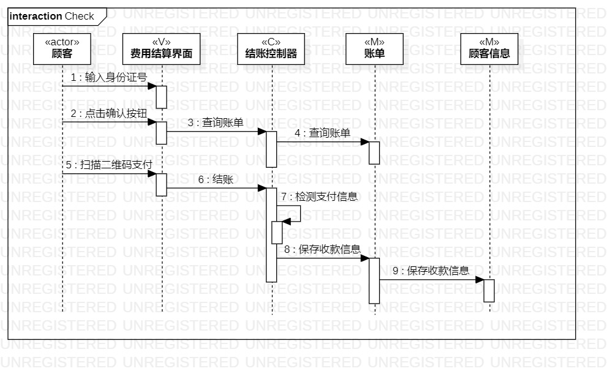

# 实验六：交互建模

## 一、实验目标

1. 理解系统交互；
2. 掌握UML顺序图的画法；
3. 掌握对象交互的定义与建模方法。

## 二、实验内容

1. 根据用例模型和类模型，确定功能所涉及的系统对象；
2. 在顺序图上画出参与者（对象）；
3. 在顺序图上画出消息（交互）。

## 三、实验步骤

1. 通过用例图，确定参与者：顾客
2. 通过类图，确定参与者：页面，控制器和模型
3. 通过活动图，确定参与者相关操作，画出参与者之间的消息

## 四、实验结果

图1：入住登记顺序图

图2：退房顺序图