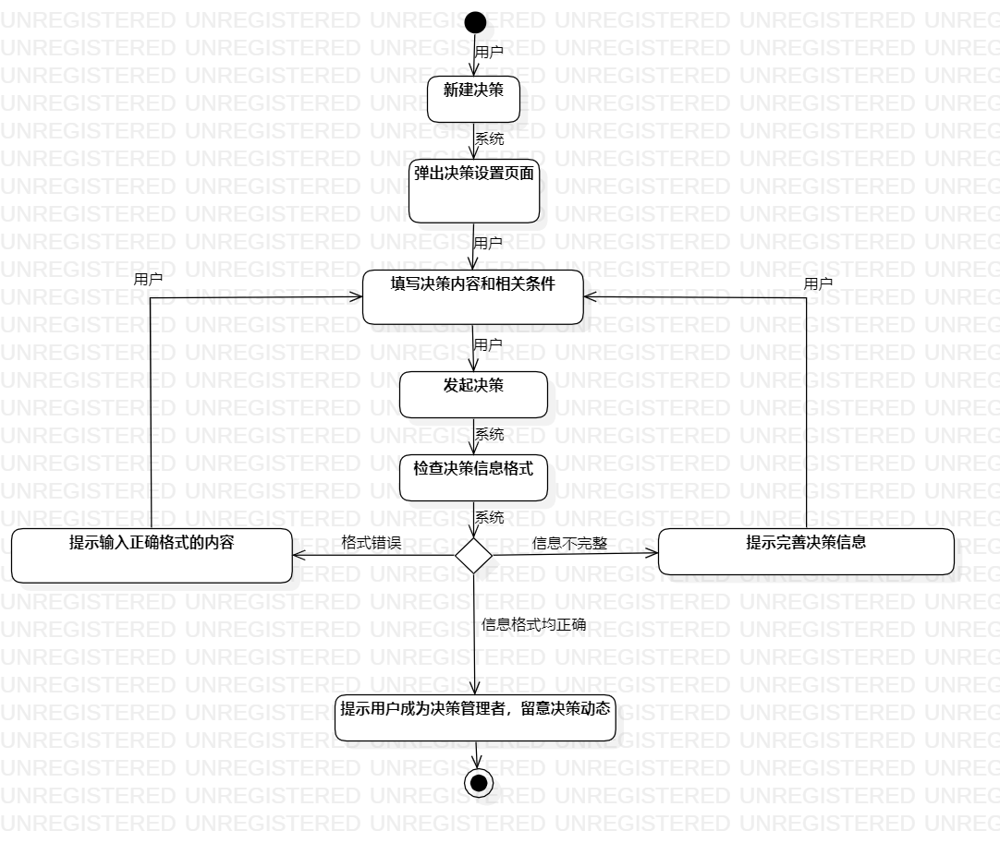
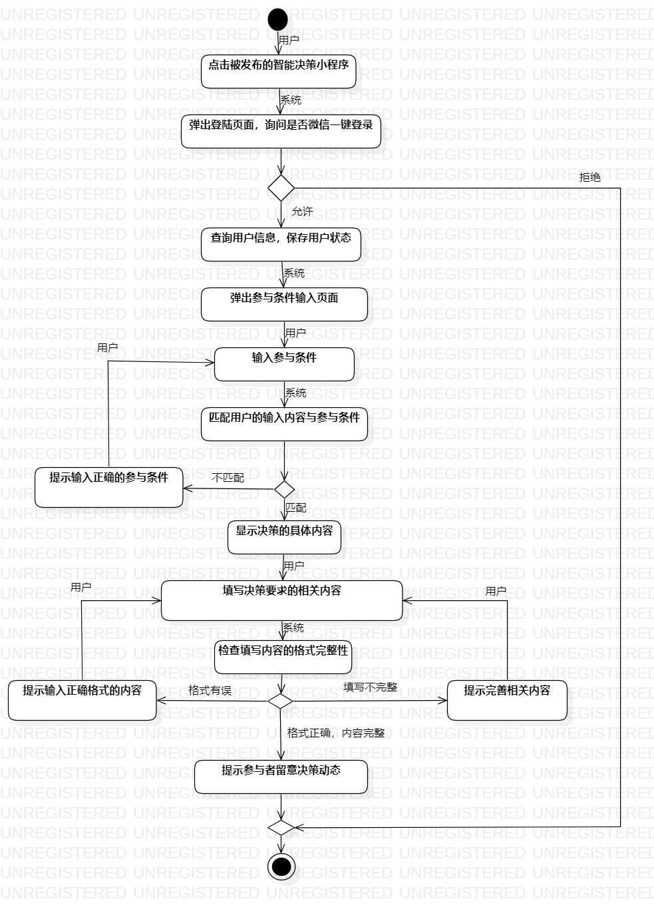
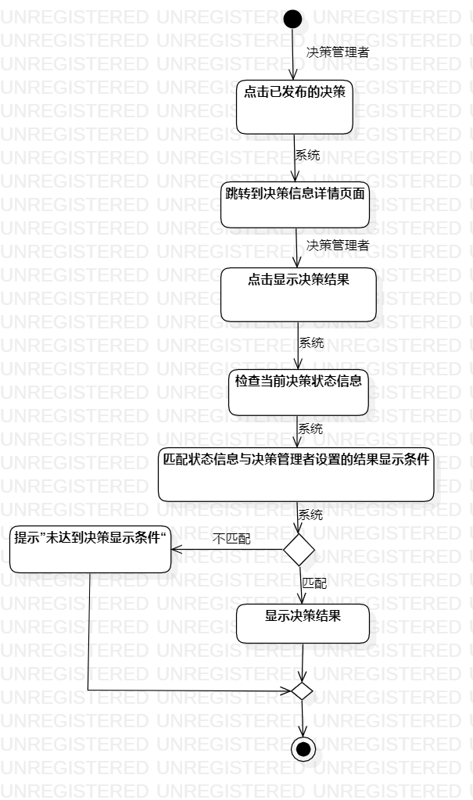

# 实验名称：过程建模  
## 一、实验目标
 - 1、掌握过程建模的方法  
 - 2、掌握活动图的画法  
## 二、实验内容
- 1、观看过程建模视频  
- 2、回顾用例建模过程  
- 3、根据用例图和用例规约来画流程图  
## 三、实验步骤
- 1、观看实验三讲解视频（https://b23.tv/av96420419/p1）和讲义（https://github.com/hzuapps/uml-modeling-2020/issues/3）  
- 2、打开实验二的用例建模文档
- 3、打开StartUML软件，根据用例规约画出每个用例的活动图
- 4、边画边校对实验二的用例规约，进行修改
## 四、实验结果  
#### 1、活动图1：发起决策  
   
  
#### 2、活动图2：参与决策  
  

#### 3、活动图3：显示决策结果  
   
  
## 五、实验心得：  
#### 本来以为用例规约已经编写的没什么问题了，到画活动图的时候才发现还有许多没有想到的漏洞，所以这次活动图的绘画实验不仅让我掌握了活动图的画法，也纠正了我实验二用例规约出现的问题，然后对于实验的各个操作也更加熟练了。

