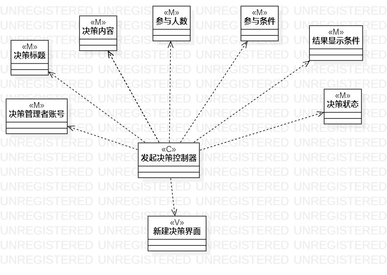
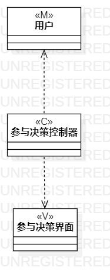
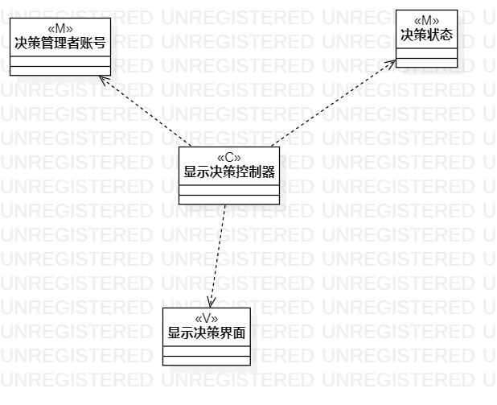

# 实验四:类建模 & 实验五:高级类建模

## 一、实验目标
- 掌握类的概念
- 理解类的5种关系和4种画法
- 掌握类建模方法
- 理解MVC设计模式
- 掌握类之间关系的画法

## 二、实验内容
- 根据用例规约绘制相应的类图。  
   1.发起决策类图  
   2.参与决策类图  
   3.显示决策类图  

## 三、实验步骤
- 查看自己的用例规约
- 找出每个用例中使用到的类以及确认类中的每个属性
- 根据MVC模式，在StarUml中进行每个用例的类图绘制
- 将类图提交到github并编写MarkDown实验报告

## 四、实验结果  
1. 发起决策类图  
  
2. 参与决策类图  
  
3. 显示决策类图  

