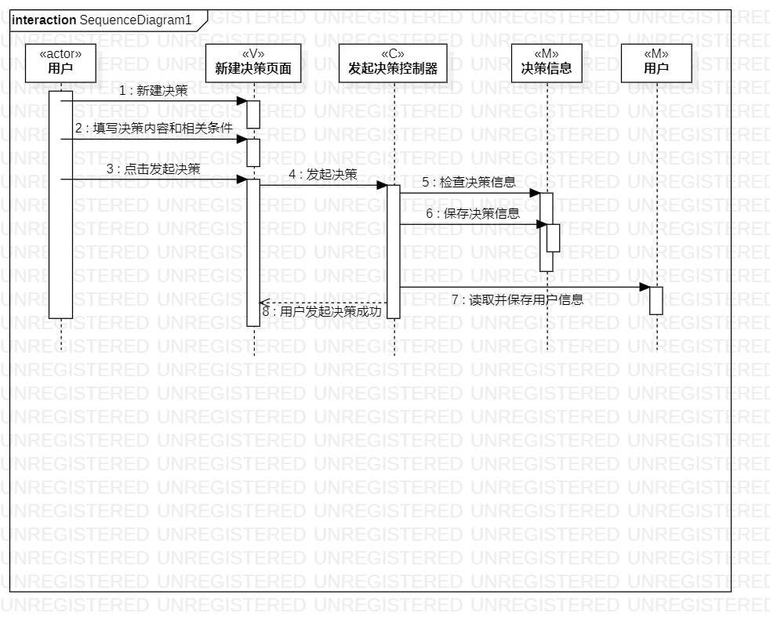
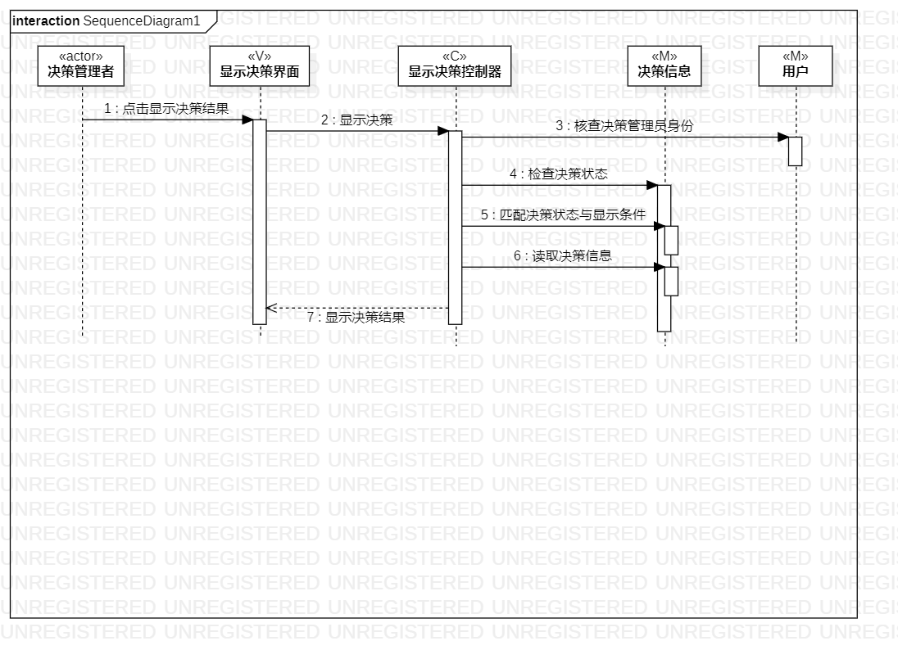

# 实验六：交互建模

## 一、实验目标
1、理解系统交互的相关概念  
2、掌握UML顺序图的画法  
3、掌握对象交互的定义与建模方法  
## 二、实验内容  

- 画出所有用例的顺序图

## 三、实验步骤

1、查看用例规约，查看类图

2、新建顺序图，找出用例图中的参与者和类图中的N个参与者，创建顺序图

3、根据活动图中的活动流程来描述每个参与者之间的联系，形成顺序图

4、磨合用例规约、活动图和顺序图

## 四、实验结果
1、画图

图1：实验6-发起决策顺序图

图2：实验6-参与决策顺序图

图3：实验6-显示决策结果顺序图
