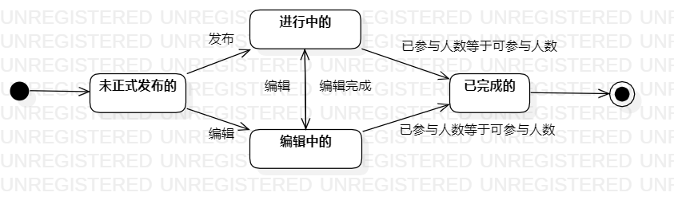

# 实验七：状态建模 

## 一、实验目标
  1、掌握对象状态建模  
## 二、实验内容
  1、观看教学视频  
  2、结合用例图、活动图、类图、时序图来绘画状态图    
  3、编写实验报告文档  

## 三、实验步骤
   1.结合整个项目选出一个关键对象  
   2.结合用例图、活动图等进行对象状态的分析和总结   
   3.在StarUML中绘制状态图

## 四、实验结果
    
  图1.决策状态图
