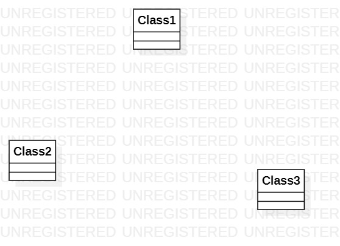

# 实验一

## 一、 实验目标

1. 熟悉github实验过程
2. 安装与使用StartUML

## 二、 实验内容

- 安装github并练习使用git bash
- 安装StartUML并创建第一个图

## 三、 实验步骤

1. 下载并安装Git和StarUML
2. 去课程库fork项目到个人仓库
3. 将项目克隆到本地磁盘
4. 用StarUML创建UML图
5. 用Git上传UML图
6. 在GitHub上创建markdown实验文档
7. 编写实验文档
8. 提交实验文档
9. 使用git pull更新本地的副本
10. 在git上pull request

## 四、 实验结果

1.画图

  
图1. 在StartUML的第一个图
