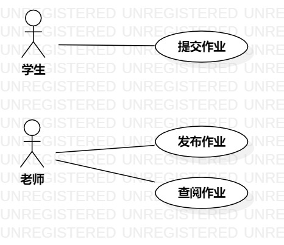

# 实验二：用例建模

## 一、 实验目标

1. 使用Markdown写报告
2. 选题并用例建模
3. 掌握用例图的画法

## 二、 实验内容

1. 建立个人选题并划分功能
2. 为所选系统功能建立用例图
3. 为所选系统功能建立用例规约
4. 提交实验二报告

## 三、 实验步骤  

1. 在issue上确定选题，并写出相关功能

   - 发布作业
   - 提交作业
   - 查阅作业

2. 根据功能画出相关Use Case图
3. 根据功能制出用例规约表
4. 提交实验2

## 四、 实验结果

1. 画图  
  
图1. 学生作业管理系统用例图

## 表1：发布作业用例规约 

用例编号  | UC01 | 备注  
-|:-|-  
用例名称  | 发布作业  |
前置条件  | 用户进入发布作业页面  | *可选*   
后置条件  | 进入系统作业管理列表     | *可选*   
基本流程  | 1. 老师选择班级；  |*用例执行成功的步骤*    
~| 2. 系统显示所有班级列表；  |   
~| 3. 老师输入作业名称、内容、截至提交时间；  |   
~| 4. 老师上传作业文件；  |   
~| 5. 老师点击发布作业按钮；  | 
~| 6. 系统检查作业是否输入完整；  |   
~| 7. 系统保存作业；  |   
~| 8. 系统显示作业管理页面。  |  
扩展流程  | 6.1 用户表单信息填写不完整，**提示“请填写完整信息”**；  |*用例执行失败*    

## 表2：查阅作业用例规约  

用例编号  | UC03 | 备注  
-|:-|-  
用例名称  | 查阅作业  |   
前置条件  | 用户已登录  | *可选*   
后置条件  | 进入系统作业管理列表     | *可选*   
基本流程  | 1. 用户选择需要查阅的作业点击查阅作业按钮；  |*用例执行成功的步骤*    
~| 2. 系统显示当前作业的详情页面（包含班级人数，提交人数，未交人数，各个学生提交情况的列表等）；  |   
~| 3. 用户点击下载学生的作业文件；  |   
~| 4. 系统检测文件是否存在，跳转到下载文件的链接；  |   
~| 5. 老师点击学生作业的查阅或驳回按钮；  |  
~| 6. 系统根据点击状态修改学生作业的状态，**提示“已查阅/已驳回”**；  |
~| 7. 系统重新加载当前页面信息；  |  
扩展流程  | 4.1 若文件不存在，**提示“文件不存在”**；  |*用例执行失败*    
