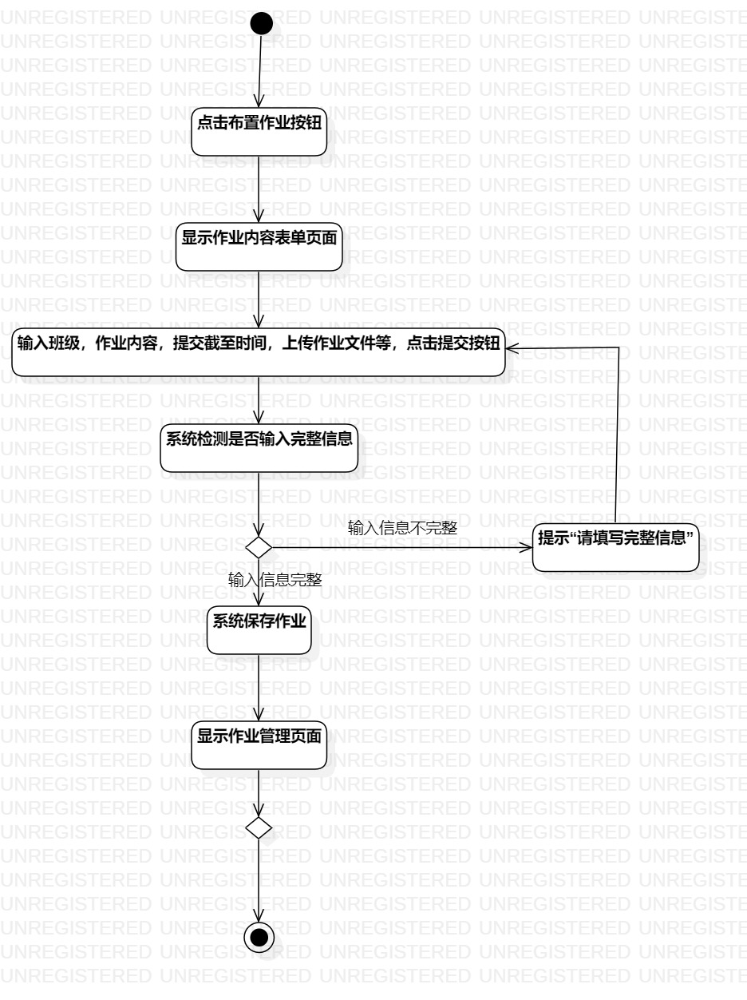
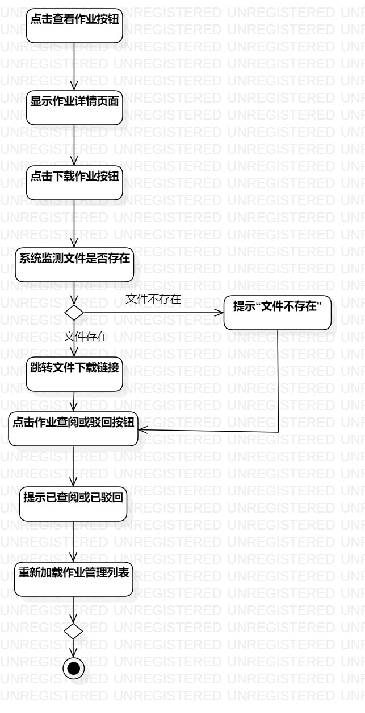

# 实验三：过程建模

## 一、 实验目标

1. 掌握过程建模的方法
2. 掌握活动图的画法

## 二、 实验内容

- 根据实验二的用例规约，画出活动图
- 完善实验二中的用例规约

## 三、 实验步骤

1. 创建活动图
2. 按照用例规约完成活动图
   - 开始initial节点
   - 基本流程和扩展流程用action
   - 分支决策使用decision
   - 最后使用final
3. 导出图片
4. 提交实验三

## 四、 实验结果

1. 活动图

  
图1. 活动图1  
  
图2. 活动图2  
