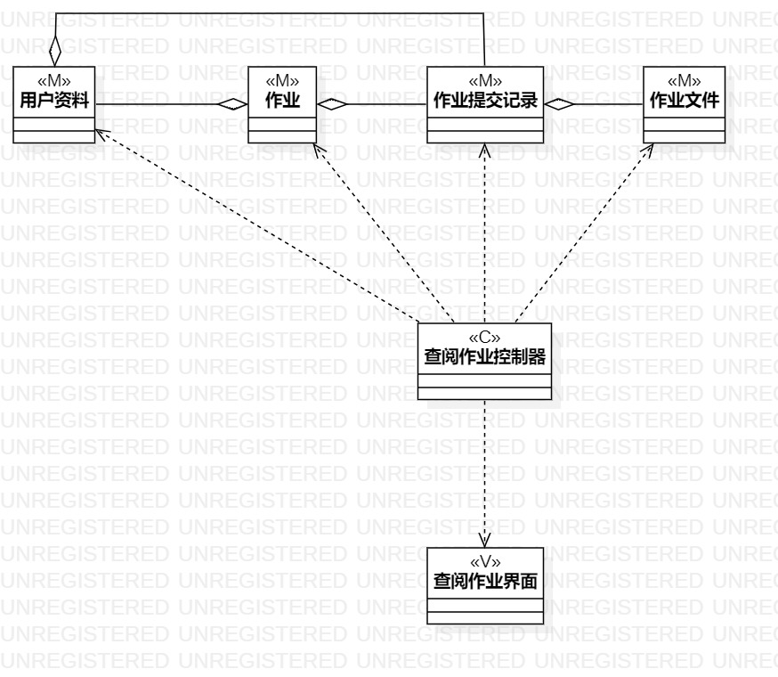

# 实验四：类建模

## 一、 实验目标

1. 掌握类建模方法；
2. 了解MVC或你熟悉的设计模式；
3. 掌握类图的画法。（Class Diagram）

## 二、 实验内容

- 了解并熟悉MVC模式
- 根据实验二的用例规约，画出类图
- 理解类的5种关系
- 熟悉类图的画法

## 三、 实验步骤

### 课程笔记

1. 有多少个用例画多少个类图
2. MVC模式

   - Model 模型 实体 数据
   - View 视图 界面 UI
   - Controller 控制器 服务类 系统  

3. 类的画法

   - 类=名称+属性+操作（属性和操作可选）

### 实验操作

1. 创建类图
2. 按照用例规约构造类图
3. 导出图片
4. 提交实验三

## 四、 实验结果

1. 类图

  
图1. 类图1  
  
图2. 类图2  
