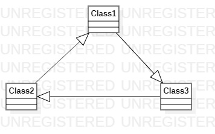

# 实验一

## 实验目标
1. 创建并提交第一个建模文档
2. 安装和使用建模工具(StarUML)
## 实验内容
1. 下载并安装建模工具 StarUML
2. 确定个人建模选题，将选题填写在 Issues 中
## 实验结果

### 选题标题：库存管理系统

+ 功能：
  - 主要功能：为仓库库存提供出入库服务,提供库存估计服务。
  - 出入库功能：对仓库库存数量进行出库,入库服务。
  - 库存预估功能：按库存损耗平均量对剩余库存进行耗空时间预估。
