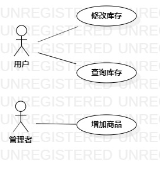

<!--
 * @Author: your name
 * @Date: 2020-03-07 16:21:55
 * @LastEditTime: 2020-04-02 20:25:48
 * @LastEditors: Please set LastEditors
 * @Description: In User Settings Edit
 * @FilePath: \undefinedf:\github\uml-modeling-2020\students\1707080714328\lab2.md
 -->
# 实验二：用例建模

## 1. 实验目标

  1. 确立自己的选题
  2. 根据自己的选题,完成功能介绍
  3. 根据自己的题目画出该题目的用例图
  4. 完成用例规约

## 2. 实验内容

 1. 在issue里提交自己的选题和功能介绍
 2. 我的题目是#140 库存管理系统，功能是：
    1. 管理者增加商品
    2. 用户修改商品库存
    3. 用户查询商品库存
 3. 根据自己的选题，找出参与者与用例，并画出用例图

## 3. 实验步骤

  1. 看选题，找出我的选题中的两个参与者：管理者和用户。
  2. 再根据选题的功能，写出三个用例： 
     1. 增加商品
	   2. 修改库存 
	   3. 查询库存
  3. 建立参与者与用例之间的联系（Association）
  4. 写出三个用例的用例规约，如下表表1、表2、表3所示

## 4. 实验结果

图1：库存管理系统的用例图

## 表1：增加商品用例规约  

用例编号  | UC01 | 增加商品  
-|:-|-  
用例名称  | 增加商品  |   
前置条件  | 1.管理者进入库存管理系统;     |
~| 2. 管理者点击增加商品按钮,进入增加商品页面.  |    
后置条件  |      |   
基本流程  | 1. 管理者输入商品详细信息，点击增加按钮；  |  
~| 2. 系统检查**商品名称是否为空**；  | 
~| 3. 系统查询商品信息，检查**商品是否存在**，保存商品信息；   |
~| 4. 系统**提示"商品增加成功"**；   |  
~| 5. 系统显示商品页面.   |   
扩展流程  | 2.1 系统检查商品名称为空，**提示“商品名称不能为空”**,返回增加商品页面.  |    
~| 3.1 系统检查商品已存在，**提示“此商品已存在”**,显示此商品页面. |  

## 表2：修改库存用例规约  

用例编号  | UC02 | 修改库存  
-|:-|-  
用例名称  | 修改库存  |   
前置条件  | 1.用户进入库存管理系统;     |
~| 2. 用户点击修改库存按钮,进入修改库存页面.  | 
后置条件  |      |    
基本流程  | 1. 用户输入修改信息，点击修改按钮；  |
~| 2. 系统查询商品信息，**检查商品库存**，更新商品信息；  |
~| 3. 系统**提示"商品库存修改成功"**；  | 
~| 4. 系统生成**修改日志**；  |     
~| 5. 系统显示商品页面.   |    
扩展流程  | 2.1 系统检查商品当前库存小于最低库存，**提示“商品库存不足,无法修改”**,返回修改库存页面； |   
~| 2.2 系统检查商品当前库存大于最高库存，**提示“商品库存过多”**. |  

## 表3：查询库存用例规约  

用例编号  | UC03 | 查询库存  
-|:-|-  
用例名称  | 查询库存    |   
前置条件  | 1.用户进入库存管理系统;     |
~| 2. 用户点击查询库存按钮,进入查询库存页面.  | 
后置条件  |      |    
基本流程  | 1. 用户输入商品名称，点击查询按钮；  |
~| 2.系统检查**商品名称是否为空**；  |
~| 3.系统查询商品信息，检查**商品是否存在**；  |      
~| 4.系统显示商品信息页面.   |   
扩展流程  | 2.1 系统检查商品名称为空，**提示“商品名称不能为空”**,返回查询库存页面.  |
~| 3.1 系统检查商品不存在，**提示“此商品不存在”**,返回查询库存页面. |   