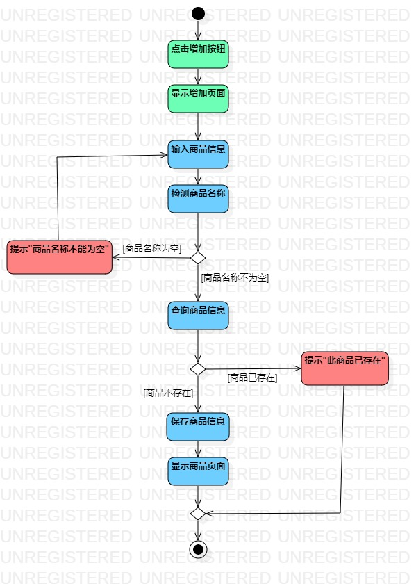
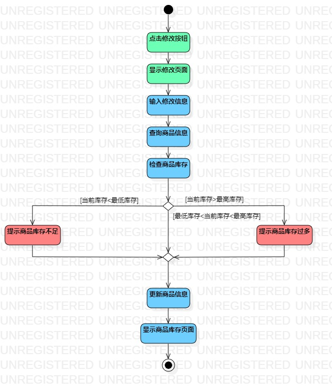
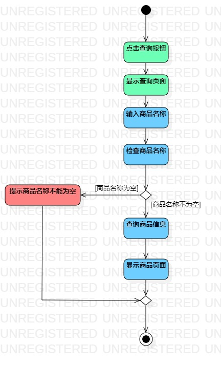

# 实验三：过程建模

## 一.实验目标

1. 掌握过程建模方法
2. 掌握活动图的画法

## 二.实验内容

1. 观看实验3视频
2. 用StarUML完成活动图,并回看视频检查注意要点
3. 完成实验报告

## 三.实验步骤

1. 观看视频，了解活动图的基本图形及其用法
2. 在StarUML创建活动图
3. 添加初始结点
4. 根据实验二的用例规约添加活动和决策点
5. 最后用控制流连接活动和相应决策点
6. 添加结束结点
7. 使用StarUML的对齐功能美化模型
8. 对活动图着色进行区别
9. 根据用例规约和注意要点检查活动图

## 四.实验结果
  
图1：教师发布视频活动图  
   
图2：教师发布作业活动图  
   
图3：教师查看评论活动图  