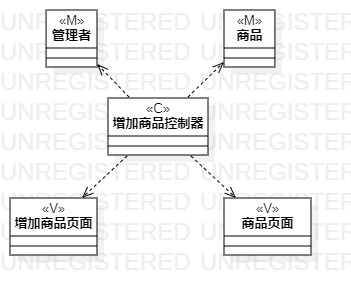
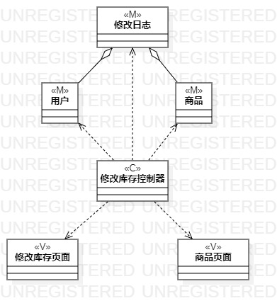
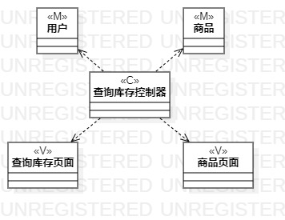

<!--
 * @Author: your name
 * @Date: 2020-03-27 13:03:26
 * @LastEditTime: 2020-04-02 20:42:04
 * @LastEditors: Please set LastEditors
 * @Description: In User Settings Edit
 * @FilePath: \undefinedf:\github\uml-modeling-2020\students\1707080714328\lab4.md
 -->
# 实验四五 类建模

## 一、实验目标

1. 掌握类建模方法；

2. 了解MVC设计模式；

3. 掌握类图的画法。

## 二、实验内容

1. 基于MVC模式设计类；

2. 设计类的关系；

3. 画出类图。

## 三、实验步骤

1. 确定设计模式,选择使用MVC模式;

2. 查看用例规约，从中找出模型、视图和控制器；

3. 绘制类图，画出模型、视图和控制器；

4. 确定类间之间的关系，连线；

5. 根据实际,检查修改用例规约和类图。

## 四、实验结果

图一：增加商品类图

图二：修改库存类图

 
图三：查询库存类图

