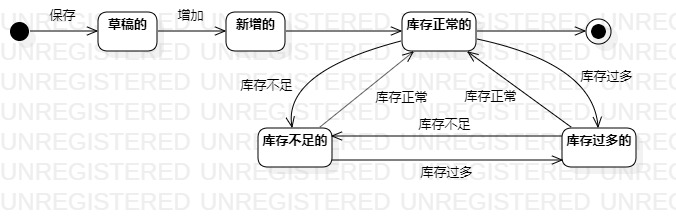

# 实验七：状态建模

## 一、实验目标

1. 掌握对象状态建模（状态图，Statechart）。 

## 二、实验内容

1. 学习状态建模的相关概念。  

2. 学习状态图的画法。  

3. 根据用例图、用例规约、活动图、类图、顺序图，确定关键对象。  

4. 绘制该关键对象的状态图。  

## 三、实验步骤

1. 根据用例图、用例规约、活动图、类图、顺序图，确定关键对象: 商品。  

2. 找出商品的相关状态: 
    1. 草稿的
    2. 已上架的
    3. 已下架的
    4. 已售罄的
    5. 已删除的

3. 找出状态之间的转变条件。

4. 用UML画出该对象的状态图

5. 写实验报告

## 四、实验结果

### 图一：商品状态图  
  

