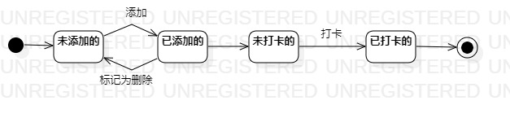

# 实验七：状态建模

 ## 1.实验目标

 1. 掌握对象状态建模（状态图，Statechart）。

 ## 2.实验内容

   1. 根据用例模型和类模型,寻找关键对象
   2. 完成状态建模并编写实验报告
   
 ## 3.实验步骤

 1. 确定了本系统关键对象--健身计划 
 2. 在状态图上设计该对象的关键状态；
 3. 根据用例模型设计状态之间的转变条件。
 4. 最后编写实验报告并提交;  

 ## 4.实验结果

   
 图1：健身计划的状态图
