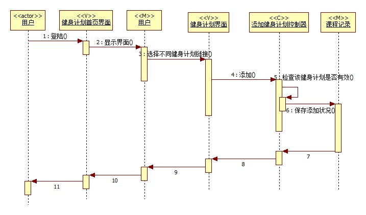
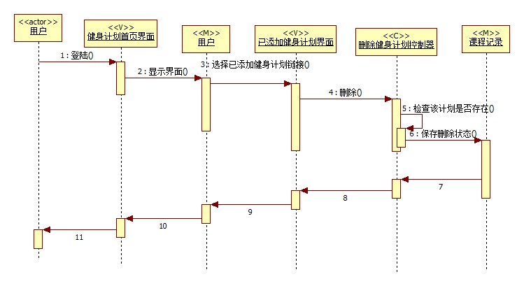
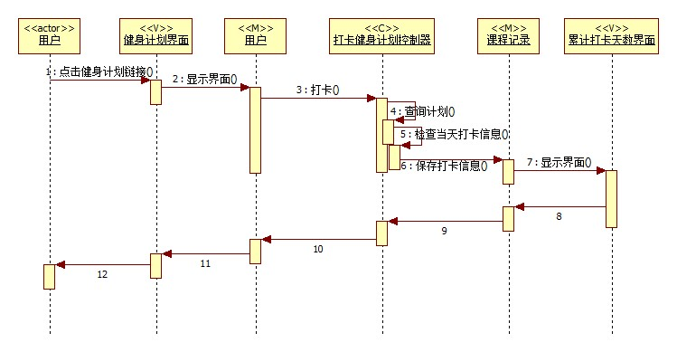

# 实验六：交互建模

## 一、实验目标

1. 理解交互建模
2. 理解顺序的构成、顺序图的“时间顺序”、消息以及存活条的概念
3. 掌握交互建模的方法以及学习画顺序图

## 二、实验内容

1. 根据用例图和类图，确定顺序图中的系统对象（参与者、类）
2. 学习顺序图的画法，在顺序图中画出信息交互

## 三、实验步骤

1.新建顺序图，以用例名称命名顺序图，每个用例对应一个顺序图
- 从用例图中确定参与者（actor）
- 从类图中确定N个参与者（M,C,V）
- 根据用例规约画出顺序图中的信息交互

2. 完成实验六实验报告

## 四、课堂记录

	1.顺序图包含：参与者、交互的时间顺序(从上到下)、消息、存活条
	2.时间仅表示先后顺序，垂直方向位置与时间跨度无关
	3.从用例图寻找第一个actor
	4.从类图寻找n个actor，总共1+n个actor
	5.从活动图找到操作步骤，画出参与者之间的消息

## 五、实验结果

图一：添加健身计划顺序图

图二：删除健身计划顺序图

图三：打卡健身计划顺序图
