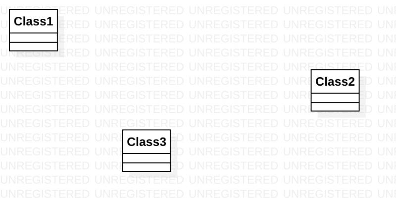

# 实验一

## 实验目标

- 下载StarUML和git
- 熟悉git和StarUML的使用

## 实验内容
	
- 创建和提交lab1.md文档
- 使用StarUML创建第一个用例建模图
- 在lab1.md文档中使用第一个用例建模图

## 实验步骤

- 1.登录github网站，进入实验库，点击fork加入课程实验库；
- 2.在自己下载的git bash中克隆实验库到本地存储；
- 3.打开StarUML，创建第一用例图，导出图片到自己的实验库；
- 4.完成实验内容之后，在git bash 中把自己的文件git push到GitHub上面；
- 5.打开GitHub网站，pull request自己的实验。

## 实验结果

- 
- 图1.第一次实验建模图

## 实验心得
- 1.每次做实验需要了解实验的目的和实验的内容，细心准确的做好实验，完成实验之后要仔细检查，查看是否有遗漏的地方；
- 2.第一次做实验，存在许多不足之处，需要在以后的时间里多加改进。
