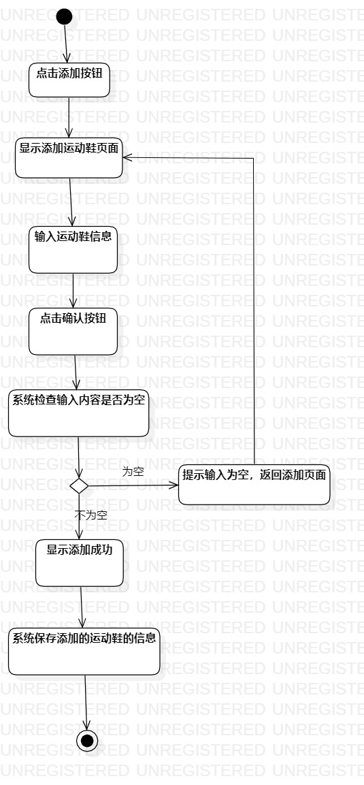
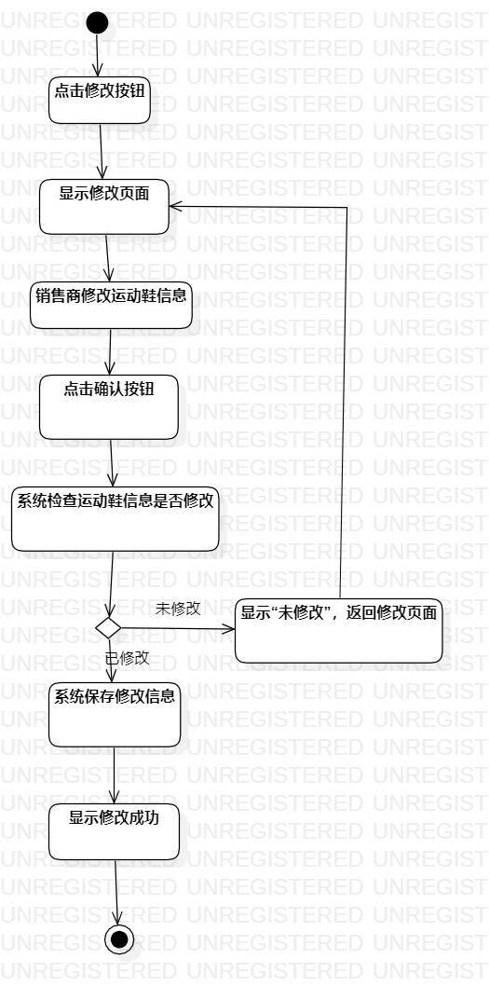

# 实验三

## 一、实验目标

- 1.掌握过程建模的方法
- 2.掌握活动图的画法（ActivityDiagram）

## 二、实验内容
	
-1.根据实验二用例建模创建一个过程建模
-2.撰写实验三实验报告

## 三、实验步骤

-1.登录GitHub了解实验内容;
-2.观看老师视频了解过程建模方法;
-3.对用例1添加运动鞋信息进行过程建模;
-4.对用例2修改运动鞋信息进行过程建模;
-5.将过程建模导出图片，放到本地实验库，通过Git bash提交到GitHub。

## 四、实验结果

-
-图1.用例添加运动鞋信息过程建模图

-
-图2.用例修改运动鞋信息过程建模图
