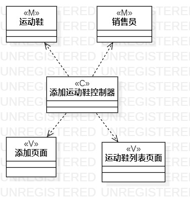
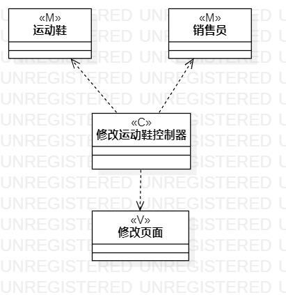

# 实验四五

## 实验目标

- 1.掌握类建模方法；
- 2.了解MVC或熟悉的设计模式
- 3.掌握类图的画法。（Class Diagram）

## 实验内容
	
- 1.基于MVC模式设计类；
- 2.设计类的关系；
- 3.画出类图。

## 实验步骤

- 1.观看视频，了解实验要求和实验目的；
- 2.了解MVC模式设计类的方法；
- 3.通过用例图确定模型类，控制器类，视图类；
- 4.在StarUML中画出类建模图；
- 5.检查类与类之间的关系是否正确，检查是否按照用例图画出的类图；
- 6.把画出的图提交到实验库中。

## 实验结果

- 
- 图1.添加运动鞋信息类图

- 
- 图1.修改运动鞋信息类图

## 实验心得
- 此次实验是根据用例图画出类图，通过老师教的MVC模式设计类，理解类之间的关系，有助于我们对所要开发的系统的深刻理解。