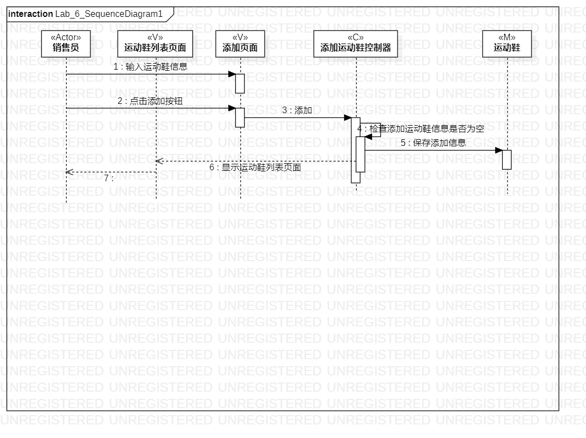

# 实验六

## 实验目标

- 1.理解系统交互；
- 2.掌握UML顺序图的画法；
- 3.掌握对象交互的定义和建模方法。

## 实验内容
	
- 1.根据用例模型和类模型，确定功能所涉及的系统对象；
- 2.在顺序图上画出参与者（对象）；
- 3.在顺序图上画出消息（交互）。

## 实验步骤

- 1.观看视频，了解实验要求和实验目的；
- 2.了解顺序图的画法；
- 3.通过用例图确定顺序图的内容；
- 4.在StarUML中画出顺序图；
- 5.检查所画顺序图是否正确，检查所画图是否规范；
- 6.把画出的图提交到实验库中。

## 实验结果

- 
- 图1.添加运动鞋信息类图

- 
- 图1.修改运动鞋信息类图

## 实验心得
- 此次实验是根据用例图和类图画出自己的顺序图，实验过程中需要注意的是查看之前的用例图是否正确，可以通过画顺序图来检查之前的类图以及用例图画的是否正确。
- 实验过程没有遇到很多问题，通过自己的理解和观看老师的视频，还是顺利完成了实验任务。