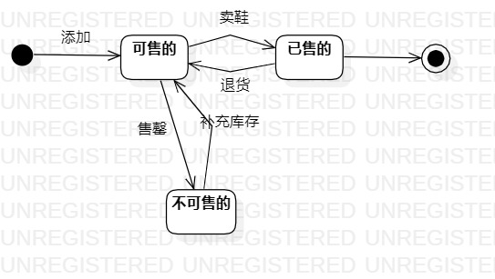

# 实验七

## 实验目标

- 1.掌握对象状态建模（状态图，Statechart）。

## 实验内容
	
- 1.寻找系统中的一个关键对象；
- 2.寻找这个关键对象的所有关键状态，进行状态建模；
- 3.找出状态之间的转换条件。

## 实验步骤

- 1.观看视频，了解实验要求和实验目的；
- 2.了解状态图的画法；
- 3.寻找系统中的关键对象——运动鞋；
- 4.对该对象进行分析，绘制状态图。

## 实验结果

- 
- 图1.运动鞋的状态图
