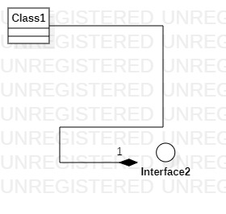

# 实验一

## 一、实验目标
1. 熟悉GitHub实验过程

2. 安装与使用StarUML

## 二、实验内容

1. 安装StarUML并创建一个图
2. 安装Git并练习使用Git Bash提交实验

## 三、实验步骤
1. 下载并安装Git和StarUML
2. fork项目到个人仓库
3. clone项目到本地磁盘
4. 创建并编辑.md文档
5. 用Git上传.md文档
6. 用StarUML创建UML图
7. 用Git上传UML图
8. 在GitHub上编辑实验文档，插入UML图
9. 使用git pull对本地Repositories和自己GitHub上的Repositories进行同步
10. pull request

## 四、实验结果

