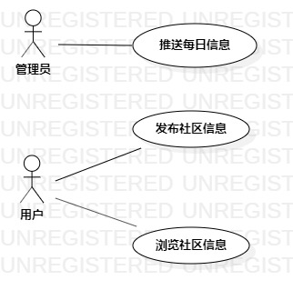

# 实验二：用例建模

## 一、实验目标
1.创建并完善选题

2.了解并掌握用例图的画法

3.通过github提交实验文档

## 二、实验内容
1.建立个人选题项目

2.根据自己的项目运用UMLStar绘制用例图

3.用git操作提交本次实验

## 三、实验步骤
 1.确立系统的功能(UseCase)
 - 每日推送
 - 发布社区信息
 - 查看社区信息
 
 2.根据功能建立Use Case
 确立系统的扮演者（Actor）
 - 用户
 - 管理员

 3.建立之间的联系（Association）

 4.编写用例规约

## 四、实验结果

 

## 表1: 推送每日信息用例规约

用例编号  | UC01 | 备注  
-|:-|-  
用例名称  | 推送每日信息  |  
前置条件  | 管理员登入系统  | *可选*  
后置条件  |   | *可选*  
基本流程  | 1. 系统显示每日推送界面  |  
~| 2. 管理员在文本框输入推送内容  |  
~| 3. 管理员点击推送按钮  |  
~| 4. 系统检查推送内容符合规范 |   
~| 5. 系统保存消息记录 | 
~| 6. 系统提示“推送成功”  | 
扩展流程  | 4.1 信息输入不合规范，系统提示“信息不规范，请重新输入”  | *用例执行失败*  

## 表2: 发布社区信息用例规范

用例编号  | UC02 | 备注  
-|:-|-  
用例名称  | 发布社区信息  |  
前置条件  | 用户登入系统并获取到地址信息  | *可选*  
后置条件  |   | *可选*  
基本流程  | 1. 用户点击发布消息按钮  |  
~| 2. 系统显示消息编辑页面  |  
~| 3. 用户在第一个文本框输入消息内容，在第二个文本框输入问题，在第三个文本框输入问题答案  |  
~| 4. 用户点击发布按钮  |  
~| 5. 系统检查发布内容符合规范  | 
~| 6. 系统保存用户编辑的信息和地址信息，显示“发布成功”  | 
扩展流程  | 5.1 信息输入不合规范，系统提示“输入不规范，请重新输入”  | *用例执行失败* 
~| 5.2 用户消息内容含敏感词汇，系统提示“含敏感词汇，请重新输入”  | *用例执行失败* 

