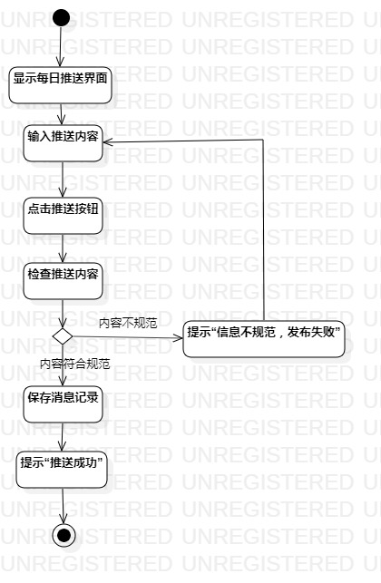
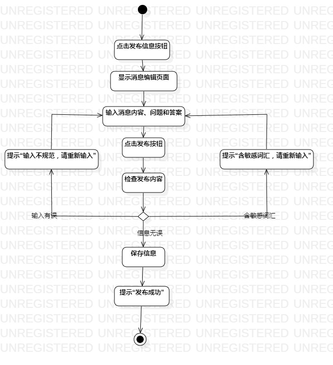

# 实验三：过程建模
## 一、实验目标

1. 掌握过程建模方法；
2. 掌握活动图（Activity Diagram）的画法。

## 二、实验内容

1. 学习活动图画法，
2. 根据用例规约用StarUML画活动图

## 三、实验步骤

1. 用StarUML画活动图
  - 创建空白活动图Activity Diagram
  - 添加开始Initial和结束Final
  - 根据用例规约确定相应的Action
  - 如果有扩展流程，添加Decision
  - 到最后添加一个Merge将分支汇总
  - 用Control Flow连接各个部分
  - 最后调整各部分位置使其工整

## 四、实验结果
### 图1：推送每日信息活动图

### 图2：发布社区信息活动图

